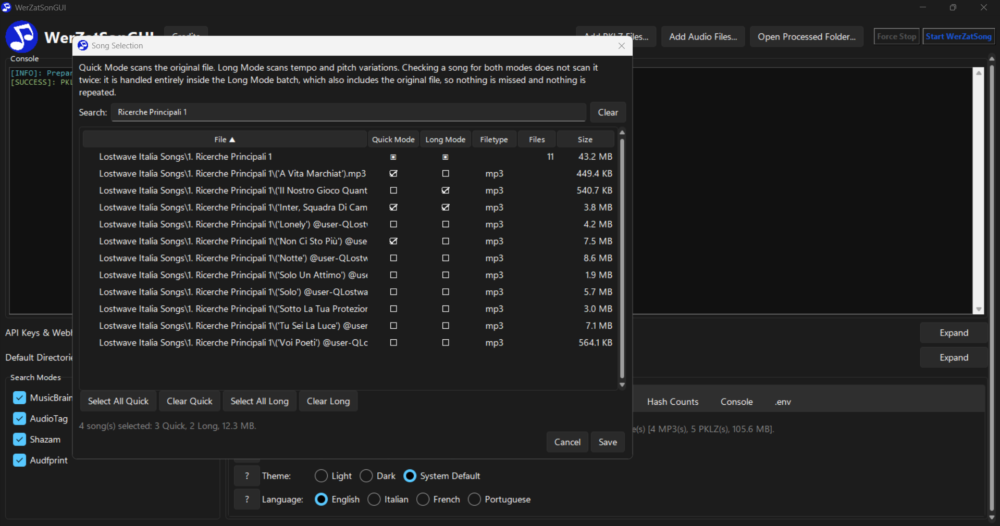
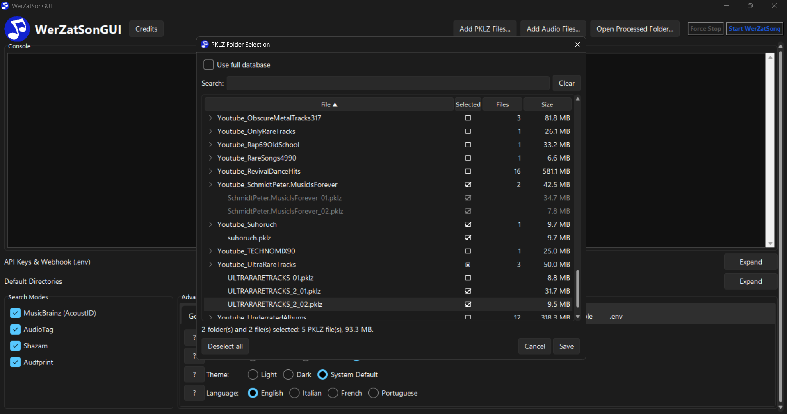

# WerZatSonGUI


**WerZatSonGUI** est une application de bureau Windows x64 qui offre une interface graphique complète pour [**WerZatSong**](https://github.com/Nel80s/WerZatSong), un outil de recherche de chansons en ligne. Si vous avez déjà utilisé WerZatSong, cette application fonctionne de la même manière, mais vous n'avez plus besoin d'ouvrir manuellement un terminal ni de saisir des commandes pour l'utiliser. Consultez la section [*🌟 Fonctionnalités*](#-fonctionnalit%C3%A9s) pour plus d'informations.

Ce document explique comment installer WerZatSonGUI, le configurer pour la première fois et utiliser toutes les fonctionnalités de son interface.
> **For English speakers**: a full English translation of this document is available in [**README.md**](../README.md).

> **Per chi parla italiano**: una traduzione completa di questo documento è disponibile in [**README_ITA.md**](README_ITA.md).

> **Para quem fala português**: uma tradução completa deste documento está disponível em [**README_POR.md**](README_POR.md).

## Table des matières

**Informations générales:**
- [🚀 Guide d'installation rapide](#-guide-dinstallation-rapide)
- [🌟 Fonctionnalités](#-fonctionnalit%C3%A9s)

**Guides (Configuration):**
- [Exigences](#exigences)
- [Installation](#installation)
- [Première configuration](#premi%C3%A8re-configuration)
- [Avertissements SmartScreen / Antivirus](#avertissements-smartscreen--antivirus)

**Guides (Utilisation de l'application):**
- [Utilisation de WerZatSonGUI](#utilisation-de-werzatsongui)
- [Explication des modes de recherche](#explication-des-modes-de-recherche)
- [Lancer une analyse: mode rapide ou mode long](#lancer-une-analyse-mode-rapide-ou-mode-long)
- [Chansons traitées et fenêtres de sélection](#chansons-traitées-et-fenêtres-de-sélection)
- [Où trouver les résultats](#o%C3%B9-trouver-les-r%C3%A9sultats)
- [Format des journaux](#format-des-journaux)

**Comment contribuer au projet:**
- [Ajouter une langue / Traductions](#ajouter-une-langue--traductions)

**Crédits:**
- [Crédits](#cr%C3%A9dits)

## 🚀 Guide d'installation rapide

### 1️⃣ Si vous *avez déjà* WerZatSong ou une ancienne version de WerZatSonGUI:

1. **Téléchargez** et **extrayez dans un dossier vide** `upgrade_to_GUI.zip`.
2. **Exécutez** `upgrade_to_GUI.bat` et suivez les instructions.
3. **Lancez** l'application.
> Si vous ne pouvez pas double-cliquer directement, ouvrez le fichier `WerZatSonGUI.pyw` avec `Python`, `pythonw.exe` ou `pyw.exe`.

4. **Ajoutez** vos chansons via le bouton **Add Audio Files...**.
5. **Ajoutez** vos fichiers pklz via le bouton **Add PKLZ Files...**.
6. **Sélectionnez** vos modes de recherche préférés.
7. Cliquez sur **Start WerZatSong**.

### 2️⃣ Si vous êtes un *nouvel utilisateur:*
1. **Téléchargez** et exécutez `WerZatSonGUI_Installer.exe`.

2. **Lancez** l'installateur et suivez les instructions; l'assistant vous fera installer **Visual Studio Build Tools** et **Rust**, et s'occupera automatiquement des autres dépendances.
> Assurez-vous de sélectionner la **charge de travail "Développement Desktop en C++"** (Desktop development with C++ workload) lors de l'installation des Visual Studio Build Tools. Si vous avez déjà Visual Studio, **recherchez** et **modifiez** votre dernière installation "Visual Studio Build Tools" (V.S.B.T. 2026, à la date de 2026) pour ajouter cette option.


3. (Si votre PC redémarre) **Relancez** l'installateur pour terminer l'installation des dépendances.

4. **Double-cliquez** sur le raccourci créé sur votre Bureau, ou **exécutez** `WerZatSonGUI.pyw` dans le dossier d'installation.

> Si vous ne pouvez pas double-cliquer directement, ouvrez le fichier `WerZatSonGUI.pyw` avec `Python`, `pythonw.exe` ou `pyw.exe`.

> Lisez [*"Dépannage: Comment corriger l'erreur de démarrage "Missing Dependencies" / "Crash Prevented!""*](#dépannage--comment-corriger-lerreur-de-démarrage--missing-dependencies--crash-prevented-) si vous rencontrez des difficultés pour démarrer le programme.


5. **Saisissez** votre Webhook Discord et vos clés API (AcoustID, AudioTag) lorsque vous y êtes invité.

> Voir [*"Comment obtenir une URL de Webhook Discord"*](#comment-obtenir-une-url-de-webhook-discord) ci-dessous.

> Voir [*"Comment obtenir une clé API AudioTag"*](#comment-obtenir-une-clé-api-audiotag) ci-dessous.

> Voir [*"Comment obtenir une clé API AcoustID (MusicBrainz)"*](#comment-obtenir-une-clé-api-acoustid-musicbrainz) ci-dessous.


6. **Ajoutez** vos chansons via le bouton **Add Audio Files...**.
7. **Ajoutez** vos fichiers pklz via le bouton **Add PKLZ Files...**.
8. **Sélectionnez** vos modes de recherche préférés.
9. Cliquez sur **Start WerZatSong**.

## 🌟 Fonctionnalités
- Toutes les commandes de [**WerZatSong**](https://github.com/Nel80s/WerZatSong) sont prises en charge: les 4 modes de recherche (**MusicBrainz (AcoustID), AudioTag, Shazam** et **Audfprint**) sont présents, et n'importe quel nombre d'entre eux peut être combiné en une seule analyse.
- Prise en charge de **bases de données de chansons entières** grâce à un **moteur d'analyse par lots**, qui vous permet d'ajouter autant de fichiers audio que vous le souhaitez au programme: il analysera automatiquement au maximum 20 à 30 fichiers à la fois, de la manière la plus efficace possible (voir [*Lancer une analyse: mode rapide ou mode long*](#lancer-une-analyse-mode-rapide-ou-mode-long) ci-dessous). Des liens vers les bases de données communautaires [Lostwave Italia](https://drive.google.com/drive/folders/1S0Tj-PrdKzUc1jZ4c2feUGcyBABLdaEy), [French Lostwaves](https://drive.google.com/drive/folders/1NLVjBYXNdWy_kxp21Npds6T3F6QpA520) et [@user-QLostwave (Q)](https://drive.google.com/drive/folders/1dlU0MmdcwzYXB_LqYz9KZdokD7lO5ZMW) sont inclus dans le programme sous la section **Add Audio Files...**.
- Un script intégré de **Mystic65**, qui peut générer et rechercher automatiquement des dizaines de **variations de tempo/hauteur** de chaque fichier, pour aider à identifier les chansons accélérées, ralenties ou dont la hauteur a été modifiée (voir [*Lancer une analyse: mode rapide ou mode long*](#lancer-une-analyse-mode-rapide-ou-mode-long) ci-dessous).
- Une **refonte de la base de WerZatSong** et une **refonte des journaux** (voir [*Format des journaux*](#format-des-journaux) ci-dessous) par **EierkuchenHD.**
- Deux fichiers JSON de **chansons traitées** (un par mode d'analyse) remplacent l'ancien `PROCESSED.txt` unique. Si vous avez un nombre important de chansons dans votre dossier d'entrée, vous pouvez désormais décider facilement lesquelles analyser avec WerZatSonGUI grâce à la fenêtre **Sélectionner des morceaux...**, **sans** avoir à éditer un fichier texte à la main ni à les déplacer hors de ce dossier (voir [*Chansons traitées et fenêtres de sélection*](#chansons-traitées-et-fenêtres-de-sélection) ci-dessous).
- Un sélecteur **Mode d'analyse** (**Rapide uniquement**, **Long uniquement**, **Les deux**) qui décide quels modes s'exécutent lors de la session en cours, remplaçant l'ancienne case "générer des tempos différents", avec une option d'analyse complète en un seul clic (voir [*Lancer une analyse: mode rapide ou mode long*](#lancer-une-analyse-mode-rapide-ou-mode-long) ci-dessous).
- Une fenêtre **Sélectionner des morceaux...**: un arbre de votre dossier d'entrée avec une case Rapide/Long par morceau, vous permettant de planifier exactement quels morceaux sont candidats pour chaque mode.
- Une fenêtre **Sélectionner des dossiers PKLZ...**: un arbre de votre base de données Audfprint, avec recherche et tri, doté d'une case à cocher sur chaque dossier **et sur chaque fichier `.pklz` individuel**, vous permettant de restreindre une analyse exactement aux fingerprints voulus au lieu de toujours analyser toute la base. Chaque ligne indique combien de fichiers PKLZ elle contient et l'espace disque occupé, et tout ce que vous sélectionnez est analysé en une seule passe.
- Un choix **Copier / Déplacer** dans les fenêtres **Add PKLZ Files...** et **Add Audio Files...**. Déplacer (l'option par défaut) supprime les fichiers source après une copie réussie; Copier les laisse où ils sont.
- Prise en charge de **plusieurs langues** et **traductions**. Actuellement, les langues prises en charge sont le français, l'anglais, l'italien et le portugais (voir [*Ajouter une langue / Traductions*](#ajouter-une-langue--traductions) ci-dessous).
- Prise en charge des modes **clair** et **sombre**.

## Exigences

WerZatSonGUI n'est actuellement **pris en charge que sur Windows x64** (il repose sur des fonctionnalités spécifiques à Windows telles que l'ouverture de dossiers dans l'Explorateur de fichiers et le lancement de fenêtres de console natives).

> **Remarque:** Vous n'avez **pas** besoin d'installer vous-même ces éléments! L'installateur décrit ci-dessous s'occupe automatiquement de Node.js, Python et FFmpeg en utilisant **WinGet** (en vérifiant correctement à la fois qu'ils sont installés *et* qu'ils respectent la version minimale ci-dessus, en les mettant à niveau si une ancienne copie est trouvée), et vous guide dans l'installation de Rust et des outils de compilation C++ (voir ci-dessous pour les raisons). Les exigences ne sont listées ici que pour que l'utilisateur sache ce qui se passe pendant l'installation, et pour le cas exceptionnel où l'installation échouerait pour l'un d'eux (voir *"Si l'installation ne marche pas"* ci-dessous).

Les exigences sont les mêmes que celles dont le WerZatSong original a besoin pour fonctionner:

- [**Node.js**](https://nodejs.org) (v20.0 ou supérieure)
- [**Python**](https://www.python.org/downloads) (v3.13 ou supérieure)
- [**FFmpeg**](https://www.gyan.dev/ffmpeg/builds)
- **Rust** et les **Outils de compilation C++** (nécessaires uniquement pour corriger quelques erreurs lors de la compilation de certaines dépendances Python). Toute version de Visual Studio à partir de **2017** fonctionne, tant que sa charge de travail **"Développement Desktop en C++"** (les outils de compilation C++ proprement dits) est installée; une installation complète de l'*IDE* Visual Studio n'est pas du tout requise, et n'est pas détectée comme substitut si la charge de travail C++ elle-même est manquante.

Avant votre première analyse, vous aurez également besoin de:

- Une **URL de Webhook Discord**, pour recevoir les notifications de correspondance (voir *"Comment obtenir une URL de Webhook Discord"* ci-dessous)
- Une **clé API AudioTag**, requise pour le mode de recherche AudioTag (voir *"Comment obtenir une clé API AudioTag"* ci-dessous)
- Une **clé API AcoustID**, requise pour le mode de recherche MusicBrainz (voir *"Comment obtenir une clé API AcoustID (MusicBrainz)"* ci-dessous)
- Une **base de données d'empreintes Audfprint** (fichiers `.pklz`), requise pour le mode de recherche Audfprint. Vous pouvez télécharger la plupart des fichiers de base de données pklz communautaires depuis [**ici.**](https://wzs.cosine.club)
  - **Remarque**: Ces bases de données peuvent occuper beaucoup d'espace disque (même des centaines de gigaoctets); un SSD est recommandé pour de bonnes performances si vous cherchez à télécharger tous les fichiers de base de données disponibles. Heureusement, pour certaines recherches, l'utilisation de quelques fichiers pklz couvrant les bonnes sources (même genre, mêmes années, etc.) peut être tout aussi efficace, il est donc recommandé de consulter les noms des fichiers pklz et de déterminer lesquels peuvent être utiles pour vos recherches.

## Installation

### Recommandé (si vous n'avez jamais eu WerZatSong auparavant): Utiliser l'installateur

1. Téléchargez `WerZatSonGUI_Installer.exe` et exécutez-le.
2. Si votre installation de Windows est configurée dans une langue autre que le français ou l'une des autres langues prises en charge, l'installateur vous demandera d'en choisir une pour l'assistant lui-même; la langue d'interface de l'application sera ensuite automatiquement réglée pour correspondre (vous pourrez toujours la modifier plus tard dans **Paramètres avancés**, voir [*Onglet Général*](#onglet-général) ci-dessous).
3. Sur la page suivante, vous pouvez choisir de créer un **raccourci sur le bureau** (coché par défaut) en plus de l'entrée habituelle du menu Démarrer.
4. L'installateur va automatiquement:
   - Détecter une installation existante des outils de compilation C++ de Visual Studio (2017 ou plus récent) et de Rust, et les ignorer s'ils sont déjà présents.
   - Si l'un des deux est manquant, ouvrir la page de téléchargement officielle correcte pour votre version de Windows et faire une pause, en vous demandant de terminer cette installation vous-même avant de continuer (voir *"Pourquoi certaines installations ne sont pas entièrement automatiques"* ci-dessous). **Une fois l'une ou l'autre des deux installations terminée, vous devrez vous rendre sur l'écran PowerShell ouvert pour l'installation et appuyer manuellement sur ENTRÉE pour continuer.**
   - Installer Node.js, Python 3.13 et FFmpeg s'ils ne sont pas déjà sur votre système, ou les mettre à niveau si une copie existante est inférieure à la version minimale requise (via WinGet).
   - Exécuter `npm install`.
   - Exécuter `pip install -r requirements.txt`.
   - Installer pip et tous les paquets Python requis.
   - Lancer WerZatSonGUI une fois que tout est prêt.

Une fois l'installation terminée, WerZatSonGUI s'ouvre et vous guide à travers la [**Première configuration**](#premi%C3%A8re-configuration) ci-dessous.
Il se peut qu'on vous demande de redémarrer votre ordinateur (cela peut arriver après l'installation des outils de compilation C++ ou de Rust): si cela se produit, il est totalement sûr de simplement réexécuter `WerZatSonGUI_Installer.exe` une fois revenu: tout ce qui est déjà installé sera détecté et ignoré automatiquement.
Lorsque votre ordinateur redémarre et que l'installation est terminée, vous pouvez utiliser le raccourci bureau/menu Démarrer créé ci-dessus, ou aller dans le dossier où vous avez choisi d'installer le programme et double-cliquer sur le fichier `WerZatSonGUI.pyw`, pour lancer directement la configuration initiale. Si vous ne pouvez pas double-cliquer dessus, ouvrez le fichier `WerZatSonGUI.pyw` avec `pythonw.exe` ou `pyw.exe`.

#### Pourquoi certaines installations ne sont pas entièrement automatiques, mais guidées

Visual Studio Build Tools et Rust sont tous deux intentionnellement **non** installés silencieusement en arrière-plan. Visual Studio Build Tools en particulier est une installation volumineuse et lente, et les versions précédentes de cet installateur ne pouvaient pas détecter de manière fiable une installation existante, ce qui aboutissait à une réinstallation (et un re-téléchargement de centaines de composants) à chaque exécution, même lorsqu'il était déjà présent. L'installation de celui-ci (et de Rust) ouvre désormais le programme d'installation officiel correct pour votre version de Windows dans votre navigateur et attend simplement que vous confirmiez une fois que vous avez terminé, ce qui est plus lent à cliquer mais beaucoup plus prévisible et beaucoup moins susceptible d'échouer silencieusement ou de gonfler en taille.

#### Dépannage: Comment corriger l'erreur de démarrage "Missing Dependencies" / "Crash Prevented!"


Si vous avez utilisé l'installateur WerZatSonGUI et que vous obtenez une erreur de plantage en essayant de démarrer le programme (comme celle illustrée ci-dessus), cela signifie généralement que les Visual Studio Build Tools n'ont pas été installés correctement.
C'est un problème connu et très facile à corriger!

##### Étape 1: Enregistrez votre message d'erreur

Gardez la fenêtre d'erreur ouverte, ou ouvrez votre fichier `crash_logs.txt`. Assurez-vous d'avoir noté tout ce que la fenêtre d'erreur disait quelque part. Vous devrez consulter une commande spécifique de ce message d'erreur à l'*Étape 5.*

##### Étape 2: Installez Visual Studio Build Tools

> **Remarque importante:** Si votre ordinateur est configuré dans une langue autre que le français, les boutons et options de cet installateur seront dans votre langue locale! Cherchez simplement les options qui *traduisent* les termes français ci-dessous.

1. Téléchargez l'installateur officiel ici: [Visual Studio Build Tools](https://aka.ms/vs/stable/vs_BuildTools.exe)
2. Ouvrez l'installateur. Si vous voyez une liste de différents programmes, faites défiler jusqu'à trouver **Visual Studio Build Tools 2026** (ou quelle que soit la dernière version).
3. Cliquez sur le bouton **Modifier** (ou **Éditer**) à côté.
4. Une fenêtre avec plusieurs options apparaîtra. Regardez dans le coin supérieur gauche et cochez la case **Développement Desktop en C++** ou quelque chose de similaire. *(Remarque: Vous n'avez pas besoin de cocher d'autres options).*
5. Cliquez sur **"Installer"** dans le coin inférieur droit et attendez la fin.

##### Étape 3: Redémarrez votre ordinateur
Une fois l'installation complètement terminée, redémarrez votre PC pour vous assurer que les modifications sont appliquées.

##### Étape 4: Ouvrez l'invite de commandes en tant qu'administrateur
1. Cliquez sur la barre de recherche Windows en bas de votre écran et tapez `cmd`.
2. Faites un clic droit sur **Invite de commandes** et sélectionnez **Exécuter en tant qu'administrateur**.

##### Étape 5: Exécutez la commande de correction
Maintenant, revenez au message d'erreur de l'étape 1. Vous verrez une ligne de texte qui ressemble à ceci:
`"C:\Program Files\Python313\python.exe" -m pip install -r C:\WerZatSonGUI\requirements.txt`

Copiez et collez simplement cette ligne, `"C:\Program Files\Python313\python.exe" -m pip install -r C:\WerZatSonGUI\requirements.txt`, dans votre fenêtre cmd, puis appuyez sur **Entrée**.

Après cela, laissez-le charger et finir son travail.
Une fois terminé, vous pouvez fermer la fenêtre et exécuter WerZatSonGUI: cela fonctionnera désormais.

### Recommandé (si vous avez déjà WerZatSong ou une ancienne WerZatSonGUI installée): upgrade_to_GUI.zip

Si vous préférez ne pas exécuter l'installateur du tout (par exemple, pour éviter l'avertissement SmartScreen décrit dans [*Avertissements SmartScreen / Antivirus*](#avertissements-smartscreen--antivirus) ci-dessous), et que vous avez déjà soit le **WerZatSong** original en ligne, soit une ancienne copie de **WerZatSonGUI** installée et fonctionnelle, vous n'avez pas besoin de tout réinstaller à partir de zéro. Dans les versions publiées, vous trouverez `upgrade_to_GUI.zip`. Extrayez cette archive dans un dossier vide et exécutez `upgrade_to_GUI.bat`: il gérera automatiquement les deux cas puisque presque tout ce dont il a besoin (Node.js, Python, Rust, les outils de compilation C++, FFmpeg) est déjà sur votre système.

Double-cliquez dessus et il va:

1. Vous demander de choisir le français (ou une autre langue prise en charge) pour ses propres messages.
2. Demander le chemin complet vers votre dossier WerZatSong/WerZatSonGUI existant (la fonction "Copier l'adresse en tant que texte" de l'Explorateur fonctionne bien ici, les guillemets et une barre oblique inverse finale sont gérés automatiquement).
3. Détecter quelle situation s'applique, vous montrer exactement ce qu'il va faire, et demander confirmation avant de toucher quoi que ce soit:
   - **Une installation WerZatSong héritée, non graphique** (un `werzatsong.js` directement dans le dossier, pas de `WerZatSonGUI.pyw`): il restructure le dossier pour vous, déplaçant tout ce qui s'y trouve actuellement dans un nouveau sous-dossier `assets`, déplaçant `assets\logs` vers `logs`, et déplaçant le contenu de `assets\input` dans `db_inputs\legacy_werzatsong_input` (afin que tout ce que vous aviez précédemment mis en file d'attente ne soit pas perdu, juste déplacé là où WerZatSonGUI s'attend à trouver les fichiers d'entrée ajoutés manuellement).
   - **Une installation WerZatSonGUI existante** (un `WerZatSonGUI.pyw` déjà dans le dossier): il la rafraîchit sur place, sans rien restructurer.
4. Dans les deux cas, il remplace ensuite le contenu entier du dossier `assets` (`werzatsong.js` et tout ce qui se trouve sous `utils`, `scripts`, `libs`, `resources`, `images`, `localizations`, etc.) par la version actuelle, et copie les derniers `WerZatSonGUI.pyw`, `requirements.txt` et `package.json`. **Votre `assets\database` (empreintes pklz) et `assets\.env` (clés API/webhook) ne sont jamais touchés ni supprimés**, car aucun des deux ne fait partie du lot copié.
   - Lors de la migration d'une installation héritée, `config.json` est également copié pour la première fois (il n'y a pas encore de configuration graphique existante à préserver).
   - Lors de la mise à jour d'une installation WerZatSonGUI existante, **`config.json` est délibérément laissé intact**, pour que vos répertoires, thème et langue restent exactement tels que vous les avez laissés; le script nettoie également tout fichier résiduel de style `advanced_settings_explainations.json` dans `assets`, un ancien fichier d'explication des paramètres antérieur à la localisation, entièrement remplacé par le dossier `assets\localizations` (voir [*Ajouter une langue / Traductions*](#ajouter-une-langue--traductions) ci-dessous) et qui autrement resterait inutilisé.
5. Exécute `pip install -r requirements.txt` pour vous.
6. Crée (ou rafraîchit) un raccourci bureau **WerZatSonGUI** pointant vers le dossier, exactement comme le raccourci de l'installateur.

Une fois terminé, utilisez ce raccourci (ou double-cliquez directement sur `WerZatSonGUI.pyw` dans le dossier) pour lancer l'application. Si vous ne pouvez pas double-cliquer sur le fichier ou utiliser le raccourci directement, ouvrez le fichier `WerZatSonGUI.pyw` avec `pythonw.exe` ou `pyw.exe`. Si une analyse se plaint ultérieurement d'un module Node manquant, ouvrez un terminal dans ce dossier et exécutez `npm install` une fois.

### Si l'installation ne marche pas

Si une étape de l'installateur automatique échoue, vous pouvez tout installer à la main:

1. **Installez Node.js, Python et FFmpeg** manuellement à partir des liens de la section [Exigences](#exigences), en vous assurant que chacun est ajouté au `PATH` de votre système. Vérifiez qu'ils sont correctement installés (et respectent les versions minimales ci-dessus) en ouvrant un terminal dans le dossier WerZatSonGUI et en exécutant:

    ```bash
    node -v
    npm -v
    python --version
    pip --version
    ffmpeg -version
    ```

    Vous devriez voir les numéros de version pour chacun, comme ceci:

    

2. **Installez les dépendances Node.js**:

    ```bash
    npm install
    ```

3. **Installez les dépendances Python**, une commande à la fois:

    ```bash
    pip install -r requirements.txt
    pip install audioop-lts
    pip install shazamio
    ```

    - **Remarque**: Si vous rencontrez une erreur pendant l'installation de ces dépendances, cela peut être dû à des dépendances manquantes. Voici deux problèmes courants et leurs solutions:
        - **Erreur Rust** (voir capture d'écran ci-dessous):
            - Installez Rust depuis [le site officiel](https://www.rust-lang.org/tools/install) (ou directement via le [téléchargement rustup-init.exe](https://static.rust-lang.org/rustup/dist/x86_64-pc-windows-msvc/rustup-init.exe)).
            - Après l'installation, vérifiez qu'il fonctionne en exécutant `rustc --version` dans votre terminal.
            - Une fois Rust installé, réessayez les commandes `pip install` ci-dessus.
            
        - **Erreur Outils de compilation C++** (voir capture d'écran ci-dessous):
            - Installez les outils de compilation C++ de Visual Studio: sur **Windows 11**, utilisez la [version actuelle](https://aka.ms/vs/stable/vs_BuildTools.exe); sur **Windows 10**, utilisez plutôt [Visual Studio 2022 Build Tools](https://aka.ms/vs/17/release/vs_buildtools.exe) (la version la plus récente encore prise en charge là-bas). Toute version à partir de 2017 fonctionne de la même manière, ceci est juste le lien de téléchargement actuel.
            - Pendant l'installation, sélectionnez la charge de travail *"Développement Desktop en C++"*. Le reste de Visual Studio lui-même n'est pas nécessaire.
            - Après l'installation, redémarrez votre machine.
            - Réessayez les commandes `pip install` ci-dessus.
            

4. **Téléchargez le code source** en cliquant sur `<> Code` -> `Download ZIP`, puis extrayez le fichier ZIP avec le code source où vous préférez. Les fichiers/dossiers suivants peuvent ensuite être supprimés, car ils ne sont utilisés que par l'installateur:
	```
	get_pip.py
	setup.iss
	setup_deps.ps1
	Languages folder
	output folder
    _upgrade_script folder
	```

5. **Lancez WerZatSonGUI** en double-cliquant sur `WerZatSonGUI.pyw` (ou en exécutant `pythonw WerZatSonGUI.pyw` depuis un terminal dans ce dossier).

## Première configuration

La toute première fois que vous lancez WerZatSonGUI, il remarque qu'aucun fichier `.env` n'existe encore dans son dossier `assets` et passe dans une petite fenêtre de configuration au lieu d'afficher l'interface complète:

1. Il vérifie d'abord que les dossiers `db_inputs` et `assets\input` sont tous deux vides. Si l'un d'eux contient déjà des fichiers, vous obtiendrez un message d'erreur vous demandant de les vider et de relancer: c'est un contrôle de sécurité pour s'assurer que rien n'est traité accidentellement avant la fin de la configuration.
2. Il exécute `npm install` dans sa propre fenêtre de terminal, la fermant automatiquement une fois terminé.
3. Il exécute `pip install -r requirements.txt` dans sa propre fenêtre de terminal, la fermant automatiquement une fois terminé.
4. Il ouvre ensuite une seconde fenêtre de terminal qui vous demande, un par un, votre **URL de Webhook Discord**, votre **clé API AudioTag** et votre **clé API AcoustID**:

    

    Collez chaque valeur lorsque vous y êtes invité et appuyez sur Entrée. Si quelque chose que vous saisissez est rejeté (une clé ou un webhook invalide), WerZatSonGUI rouvrira automatiquement ce terminal pour que vous puissiez réessayer: vous n'avez pas besoin de redémarrer toute l'application.
5. Une fois les trois acceptées, elles sont enregistrées dans `assets\.env` et WerZatSonGUI se relance automatiquement dans l'interface complète.

### Comment obtenir une URL de Webhook Discord

Votre webhook Discord est l'endroit où WerZatSonGUI vous envoie une notification (avec des détails, et pour certains modes de recherche un fichier de résultats) chaque fois qu'une analyse trouve une correspondance probable.

1. Ouvrez Discord et créez votre propre serveur (*si* vous n'en avez pas déjà un à utiliser pour cela).
2. Allez dans n'importe quel canal texte (par exemple **#general**). Cliquez sur l'icône d'engrenage (⚙️) à côté de son nom pour ouvrir le menu **Modifier le canal**.
3. Allez dans **Intégrations → Webhooks**.
4. Cliquez sur **Créer un Webhook**, puis ouvrez-le et sélectionnez **Copier l'URL du Webhook**.
5. Collez cette URL lorsque WerZatSonGUI vous la demande pendant la configuration (ou après, dans la section **Clés API et Webhook (.env)** de l'interface principale).

Vous pouvez éventuellement donner à ce webhook un nom d'affichage et une image d'avatar personnalisés directement depuis l'**onglet Discord** des **Paramètres avancés** de WerZatSonGUI (voir [*Utilisation de WerZatSonGUI*](#utilisation-de-werzatsongui) ci-dessous).

### Comment obtenir une clé API AudioTag

Cette clé est requise pour utiliser le mode de recherche **AudioTag**.

1. Allez sur le site [AudioTag](https://audiotag.info) et *créez un nouveau compte* (ou *connectez-vous*, si vous en avez déjà un).
2. Allez dans votre [**Section Utilisateur**](https://user.audiotag.info) et ouvrez l'onglet **Clés API**.
3. Cliquez sur **Créer une nouvelle clé API**, puis copiez-la.
4. Collez cette clé lorsque WerZatSonGUI vous la demande pendant la configuration (ou après, dans la section **Clés API et Webhook (.env)** de l'interface principale).

> **AVERTISSEMENT: un compte AudioTag gratuit est limité à environ 1 000 requêtes d'identification par mois.** Face à de vraies pistes inconnues, ce budget peut s'épuiser en aussi peu que 100 à 200 fichiers, donc AudioTag seul ne convient pas pour analyser des milliers de pistes. WerZatSonGUI ajoute un délai aléatoire entre les requêtes, une pause de sécurité périodique, et une rotation optionnelle entre les clés de plusieurs comptes gratuits pour utiliser ce budget plus prudemment; voir l'**onglet AudioTag** dans les Paramètres avancés ci-dessous. Rien de tout cela ne supprime les limites propres à AudioTag, alors restez tout de même attentif à leur service.

### Comment obtenir une clé API AcoustID (MusicBrainz)

Cette clé est requise pour utiliser le mode de recherche **MusicBrainz (AcoustID)**.

1. Allez sur le site [AcoustID](https://acoustid.org) et *créez un nouveau compte* (ou *connectez-vous*, si vous en avez déjà un).
2. Allez dans [**Mes Applications**](https://acoustid.org/my-applications) et cliquez sur **Enregistrer une nouvelle application**.
3. Remplissez les champs avec des informations de base (elles peuvent être aléatoires) et cliquez sur **Enregistrer**.
4. Copiez la **clé API** de l'application qui apparaît.
5. Collez cette clé lorsque WerZatSonGUI vous la demande pendant la configuration (ou après, dans la section **Clés API et Webhook (.env)** de l'interface principale).

### Configuration de la base de données Audfprint

Si vous prévoyez d'utiliser le mode de recherche **Audfprint**, vous pouvez télécharger les dossiers de base de données communautaires (contenant des fichiers d'empreintes `.pklz`) depuis [**ici**](https://wzs.cosine.club), puis les placer dans votre **Répertoire de la base de données Audfprint**: soit en les déposant via le bouton **Open...** à côté dans la section **Répertoires**, soit en utilisant le bouton **Add PKLZ Files...** en bas de la fenêtre (qui contient également un lien **Public PKLZ Database...** qui vous mène directement au même site). Chaque dossier de niveau supérieur agit comme sa propre collection indépendante d'empreintes (par exemple, réparties par genre ou par source):


Vous pouvez plus tard restreindre une analyse à un seul de ces sous-dossiers en utilisant **"Utiliser uniquement les empreintes de ce sous-répertoire"** dans les **Paramètres avancés**.

## Avertissements SmartScreen / Antivirus

Parce que `WerZatSonGUI_Installer.exe`, `setup_deps.ps1` et `WerZatSonGUI.pyw` ne sont pas signés avec un certificat de signature de code payant (ce qui me coûterait une somme que je ne peux pas me permettre), Windows SmartScreen et certains moteurs antivirus peuvent les signaler comme provenant d'un "Éditeur inconnu" ou même les mettre en quarantaine. Il s'agit d'une heuristique de confiance/réputation basée sur la nouveauté et la diffusion d'un fichier, **pas** un signe que quoi que ce soit est réellement malveillant. C'est un effet secondaire bien connu des logiciels Windows distribués indépendamment en général, et les certificats de signature de code ne sont pas quelque chose qu'un projet gratuit/open-source de loisir peut généralement obtenir, donc cet avertissement est censé continuer à apparaître indépendamment de toute modification apportée aux scripts eux-mêmes.

Si vous voyez une boîte de dialogue **"Windows a protégé votre ordinateur"** après avoir téléchargé `WerZatSonGUI_Installer.exe`:

1. Cliquez sur **Informations complémentaires**.
2. Cliquez sur le bouton **Exécuter quand même** qui apparaît.

Si votre antivirus met en quarantaine ou supprime `setup.iss`, `setup_deps.ps1`, `upgrade_to_GUI.bat` ou `WerZatSonGUI.pyw` au lieu de simplement les avertir, restaurez le fichier depuis la quarantaine (ou re-téléchargez/ré-extrayez-le) et ajoutez une exclusion pour le dossier WerZatSonGUI si votre antivirus le permet.

Si vous préférez contourner complètement l'installateur signalé, et que vous avez déjà une installation WerZatSong ou WerZatSonGUI fonctionnelle, voir [*Recommandé (si vous avez déjà WerZatSong ou une ancienne WerZatSonGUI installée): upgrade_to_GUI.zip*](#recommandé-si-vous-avez-déjà-werzatsong-ou-une-ancienne-werzatsongui-installée--upgrade_to_gui.zip) ci-dessus. `upgrade_to_GUI.bat` réutilise votre installation existante de Node.js/Python/Rust/Outils de compilation C++/FFmpeg et n'a jamais besoin de toucher à WinGet ou aux installateurs guidés de Visual Studio/Rust.

## Utilisation de WerZatSonGUI

Une fois la configuration terminée, WerZatSonGUI ouvre son interface complète à chaque lancement. En mode fenêtré comme en mode maximisé/plein écran, la barre d'action supérieure (**Add PKLZ Files...**, **Add Audio Files...**, **Open Processed Folder...**, **Force Stop**, **Start WerZatSong**) reste toujours visible et accessible. Si le reste de l'interface ne tient pas dans l'espace disponible (par exemple avec les sections **Clés API et Webhook** et **Répertoires** dépliées sur un écran plus petit), la section au-dessus de la barre d'action défile au lieu de la pousser hors de l'écran.

### En-tête

Le logo et le titre en haut à gauche, et un bouton **Crédits** qui ouvre une petite fenêtre pop-up remerciant tous ceux qui ont travaillé sur WerZatSonGUI, le script d'analyse par lots, et le projet original WerZatSong.

### Console

Une vue de terminal en direct. Chaque fois que WerZatSonGUI exécute une commande en arrière-plan (pendant la configuration, ou pendant qu'une analyse est en cours) sa sortie apparaît ici en temps réel. Vous pouvez zoomer sur son texte à tout moment avec **Ctrl + Molette**, **Ctrl + Plus/Moins**, ou le réinitialiser à la taille par défaut avec **Ctrl + 0**, pratique pour lire sur un petit écran ou un flux de lignes de journal dense. Cela n'interfère jamais avec le défilement normal de la console ni avec aucun autre raccourci clavier.

### Clés API et Webhook (.env)

Affiche votre **Clé API AcoustID**, votre **Clé API AudioTag** et votre **Webhook Discord**, chacune masquée derrière un bouton **Show...** afin qu'elles ne soient pas visibles à l'écran par défaut. Cliquez sur **Show...** pour révéler et modifier une valeur, ou sur **Hide...** pour la dissimuler à nouveau. Toute modification effectuée ici est enregistrée immédiatement dans `assets\.env`, sauf si une analyse est en cours, auquel cas elle est appliquée automatiquement dès que l'analyse se termine.

### Répertoires par défaut

- **Répertoire d'entrée:** où vous placez tous les fichiers audio que vous souhaitez que WerZatSonGUI analyse (par défaut un dossier `db_inputs` à côté de l'application). Ceci est **séparé** du dossier interne `assets\input` de WerZatSong, que WerZatSonGUI gère automatiquement en arrière-plan pendant une analyse.
- **Répertoire de la base de données Audfprint:** où vivent vos dossiers de base de données d'empreintes `.pklz` (voir [*Configuration de la base de données Audfprint*](#configuration-de-la-base-de-données-audfprint)).
- **Répertoire des journaux:** où les journaux de résultats sont enregistrés après chaque analyse (voir [*Où trouver les résultats*](#o%C3%B9-trouver-les-r%C3%A9sultats) et [*Format des journaux*](#format-des-journaux) ci-dessous).

Chaque ligne a un bouton **Open...** (ouvre ce dossier dans l'Explorateur de fichiers, le créant d'abord s'il n'existe pas) et un bouton **Browse...** (vous permet de choisir un autre dossier à utiliser à la place). Toute cette section est grisée pendant qu'une analyse est en cours.

### Modes de recherche

Quatre cases à cocher pour activer ou désactiver **MusicBrainz (AcoustID)**, **AudioTag**, **Shazam** et **Audfprint** (voir [*Explication des modes de recherche*](#explication-des-modes-de-recherche) ci-dessous pour ce que chacun fait). Vous pouvez activer n'importe quelle combinaison; lorsque plusieurs sont cochés, ils s'exécutent toujours dans cet ordre fixe:

1. **MusicBrainz** (AcoustID)
2. **AudioTag**
3. **Shazam**
4. **Audfprint**

### Paramètres avancés

Divisé en neuf onglets pour regrouper les paramètres connexes. Chaque paramètre individuel a un petit bouton **[?]** à sa gauche avec une courte explication, et cette section résume également ce que chacun fait. Tout ce panneau est grisé pendant qu'une analyse est en cours.

#### Onglet Général

- **Mode d'analyse:** un sélecteur à trois choix, **Rapide uniquement**, **Long uniquement** ou **Les deux**, qui décide quels modes de recherche s'exécutent réellement. Voir [*Lancer une analyse: mode rapide ou mode long*](#lancer-une-analyse-mode-rapide-ou-mode-long) ci-dessous pour ce que fait chaque option.
- **Sélectionner des morceaux...** et **Sélectionner des dossiers PKLZ...:** se trouvent côte à côte au-dessus de la ligne Mode d'analyse, partageant un seul bouton **[?]** à leur gauche. Cliquer dessus ouvre un petit sélecteur permettant de choisir laquelle des deux explications lire. **Sélectionner des morceaux...** ouvre une fenêtre listant chaque morceau de votre Répertoire d'entrée avec une case Rapide/Long chacun, remplaçant l'ancienne fonction "Marquer tous les fichiers audio comme traités dans". **Sélectionner des dossiers PKLZ...** ouvre une fenêtre listant les sous-dossiers de votre Répertoire de la base de données Audfprint, vous permettant de restreindre les recherches Audfprint à des sous-dossiers spécifiques au lieu de toujours analyser toute la base (son explication couvre les compromis liés au choix de plusieurs sous-dossiers). Voir [*Chansons traitées et fenêtres de sélection*](#chansons-traitées-et-fenêtres-de-sélection) ci-dessous pour les deux.
- **Résumé de la sélection:** un bref résumé de ce qui est actuellement sélectionné apparaît juste à droite des deux boutons ci-dessus, combinant les deux sélections. Il ressemble à quelque chose comme `10 morceaux, 2 dossiers d'empreintes, 2 fichiers d'empreintes [9 MP3(s), 1 M4A(s), 16 PKLZ(s), 500.00 MB].`. Lorsque la base d'empreintes complète est utilisée, seuls les morceaux sont mentionnés (`10 morceaux, base de données d'empreintes complète.`), et inversement (`Tous les morceaux, 2 dossiers d'empreintes, 2 fichiers d'empreintes [...]`). Le survol de la souris liste les noms réels des morceaux et dossiers/fichiers sous les en-têtes en gras **Morceaux:** et **Empreintes:**, chaque morceau annoté avec le(s) mode(s) pour le(s)quel(s) il est coché (**Rapide**, **Long** ou **Les deux**). Rien n'est affiché tant qu'au moins une des deux fenêtres n'a pas été enregistrée au moins une fois; avant cela, un texte d'attente s'affiche.
- **Thème:** Modifie l'apparence visuelle de l'application. Réglez sur **Clair**, **Sombre**, ou **Par défaut du système** pour correspondre automatiquement aux paramètres de votre système d'exploitation.
- **Langue:** Bascule l'interface entre le **français** et une autre langue prise en charge. Prend effet immédiatement, aucun redémarrage requis (voir [*Ajouter une langue / Traductions*](#ajouter-une-langue--traductions) ci-dessous si vous souhaitez aider à en ajouter d'autres).

#### Onglet Mode long

Le fait que le mode Long s'exécute ou non lors de cette session est désormais décidé par le sélecteur **Mode d'analyse** de l'**onglet Général** ci-dessus, et non par une case sur cet onglet.

- **Multiplicateurs de tempo négatifs** / **Multiplicateurs de tempo positifs:** les rapports de tempo utilisés pour générer des variations en mode Long (négatif = ralenti/transposé vers le bas, inférieur à `1.0`; positif = accéléré/transposé vers le haut, supérieur à `1.0`). Modifiez-les sous forme de liste séparée par des virgules entre crochets, par ex. `[0.9, 0.95, 1.05, 1.1]`. Laisser **un** champ vide (ou `[]`) fait que WerZatSonGUI génère des variations uniquement à partir de l'autre tableau; laisser **les deux** vides restaure l'ensemble complet de 40 variations par défaut (20 négatives + 20 positives).

#### Onglet Audfprint

Le choix de sous-dossiers PKLZ spécifiques se fait désormais via le bouton **Sélectionner des dossiers PKLZ...** de l'**onglet Général**, plus sur cet onglet; le popup **[?]** à côté explique les compromis liés au choix de plusieurs sous-dossiers.

- **Définir le nombre de fils CPU à utiliser:** définit combien de fils CPU le mode Audfprint utilise. WerZatSong lui-même plafonne cela à **16** quelle que soit la valeur saisie, pour aider à éviter l'épuisement de la mémoire; laisser cette case décochée lui permet d'utiliser automatiquement tous les threads disponibles sur votre machine.
- **Définir la profondeur de recherche sur:** contrôle l'agressivité avec laquelle Audfprint recherche une correspondance, de `1` à `8`. Des valeurs plus élevées effectuent une "recherche approfondie" plus minutieuse pour les extraits de faible qualité, mais peuvent augmenter considérablement le temps de traitement. Par défaut `4`.

#### Onglet MusicBrainz

- **Définir la plage de durée (en secondes) sur:** restreint les correspondances MusicBrainz aux chansons dont la durée se situe entre les deux valeurs que vous saisissez. Chaque valeur doit être comprise entre `30` et `600`; toute valeur en dehors de cette plage est réinitialisée aux valeurs par défaut (`30`/`600`).
- **Définir la durée initiale (en secondes) sur:** aide MusicBrainz à trouver une correspondance lorsque le début de votre fichier audio est tronqué ou retardé, en étendant la fenêtre analysée de ce nombre de secondes. Doit être compris entre `1` et `25`; toute valeur en dehors de cette plage est réinitialisée à la valeur par défaut (`25`).

#### Onglet AudioTag

Voir l'avertissement sous *"Comment obtenir une clé API AudioTag"* ci-dessus pour comprendre pourquoi ces paramètres existent: le budget d'environ 1 000 requêtes/mois d'un compte AudioTag gratuit s'épuise vite face à de vraies pistes inconnues, donc ces réglages existent pour cadencer les requêtes et, optionnellement, les répartir entre plusieurs comptes.

- **Délai entre les requêtes (secondes), min:max:** avant chaque requête AudioTag, WerZatSonGUI attend un nombre aléatoire de secondes dans cette plage (par défaut `10`-`30`), afin que les requêtes ne soient pas envoyées coup sur coup.
- **Pause (et rotation des clés) après ce nombre de pistes:** un point de contrôle de sécurité périodique (par défaut `100` pistes). Notez que cela compte des **pistes**, pas des requêtes brutes: la recherche d'une seule piste implique déjà une requête d'identification plus plusieurs vérifications de statut gratuites. À ce point de contrôle, WerZatSonGUI prend toujours la pause ci-dessous et, si **Utiliser plusieurs clés API AudioTag** est activé et qu'une autre clé utilisable est disponible, passe également à celle-ci.
- **Durée de la pause à ce point de contrôle (secondes):** la durée de cette pause périodique (par défaut `300` = 5 minutes). S'applique que plusieurs clés soient configurées ou non.
- **Durée minimale du clip envoyé à AudioTag (secondes):** le serveur d'AudioTag rejette en pratique les extraits très courts. Tout ce qui est plus court que cette valeur (par défaut `15`) est mis en boucle — en répétant son propre audio, sans ajout de silence — jusqu'à atteindre cette longueur avant l'envoi, afin que les extraits courts aient quand même une chance d'être identifiés au lieu d'être silencieusement ignorés.
- **Utiliser plusieurs clés API AudioTag:** fait tourner les recherches AudioTag parmi une liste de clés (chacune provenant d'un compte gratuit distinct) au lieu de la clé unique de **Clés API et Webhook (.env)**. Activer cette option affiche un avertissement: utiliser plusieurs clés signifie quand même solliciter davantage le serveur AudioTag, alors restez attentif à leur service. Les clés se gèrent avec les boutons **Ajouter une clé...**/**Supprimer la sélection** sous la case à cocher et sont stockées dans `assets\audiotag_keys.json`; WerZatSonGUI marque automatiquement une clé comme épuisée ou invalide en fonction des réponses du serveur lui-même et passe à la suivante utilisable, et la liste affiche le nombre d'utilisations et l'état de chaque clé (masquée jusqu'à ses 4 derniers caractères).

#### Onglet Discord

- **Utiliser un nom de webhook personnalisé:** remplace le nom d'affichage que votre webhook Discord utilise lors de la publication, au lieu du défaut "WerZatSong".
- **Utiliser une image de webhook personnalisée:** remplace l'image d'avatar que votre webhook Discord utilise lors de la publication. Le lien doit commencer par `https://cdn.discordapp.com/icons/`, `https://cdn.discordapp.com/app-icons/` ou `https://cdn.discordapp.com/avatars/`, sinon Discord ne le reconnaîtra pas. L'image doit être au format `.webp`. Vous pouvez obtenir un lien correctement formaté en définissant l'image comme photo de profil d'un bot Discord et en copiant le lien à partir de là (si nécessaire, en supprimant tout paramètre de taille à la fin et en changeant l'extension en `.webp`).

#### Onglet Nombres de hachage

- **Répertoire des nombres de hachage des fichiers .pklz:** Le dossier dans lequel les nombres de hachage sont enregistrés (créé automatiquement s'il est absent). Les nombres de hachage sont les fichiers en texte brut générés pour chaque .pklz ajouté à la base de données lorsque **Créer des nombres de hachage pour chaque fichier .pklz ajouté** est activé: ils indiquent chaque fichier audio contenu dans un .pklz et le nombre de hashes que chacun a fournis. Utilisez **Parcourir...** pour choisir un dossier ou saisissez directement son chemin. Si le champ est laissé vide, il revient au dossier par défaut `hash_tables` à côté de l'application.
- **Créer des nombres de hachage pour chaque fichier .pklz ajouté:** Lorsqu'activé, chaque fichier .pklz ajouté à la base de données via **Ajouter des fichiers pklz...** aura également un nombre de hachage créé pour lui. Un nombre de hachage est un fichier en texte brut indiquant chaque fichier audio contenu dans le .pklz et le nombre de hashes que chacun a fournis. Les nombres de hachage sont enregistrés dans le répertoire des nombres de hachage configuré, en préservant la hiérarchie originale des dossiers.

#### Onglet Console

- **Répertoire des journaux de la console:** Le dossier dans lequel les vidages du journal de la console produits par **Imprimer la sortie de la console dans un fichier journal** sont enregistrés (créé automatiquement s'il est absent). Utilisez **Parcourir...** pour choisir un dossier ou saisissez directement son chemin. Si le champ est laissé vide, il revient au dossier par défaut `console_logs` à côté de l'application.
- **Imprimer la sortie de la console dans un fichier journal:** Écrit tout ce qui est actuellement affiché dans la Console dans un fichier .txt horodaté situé dans le répertoire des journaux de la console. Le nom du fichier suit le format `AAAA-MM-JJ_HH-MM-SS_v{version}_WZSGUI_CLog.txt`, de sorte que les vidages successifs ne s'écrasent jamais. Utile pour joindre des journaux à un rapport de bug ou pour conserver une trace d'une analyse.
- **Ouvrir le fichier des journaux de plantage...:** Ouvre le fichier `crash_logs.txt` de WerZatSonGUI (le vidage stdout/stderr au démarrage). Complètement indépendant des journaux de la console.

#### Onglet .env

- **Commande Python:** Choisissez si WerZatSong doit être lancé à l'aide de la simple commande **python** ou du chemin d'accès complet vers l'exécutable Python. Utilisez le chemin d'accès complet si vous disposez de plusieurs installations Python ou si Python ne figure pas dans votre variable d'environnement PATH.
- **Commande FFmpeg:** Choisissez si vous souhaitez utiliser la commande simple **ffmpeg** ou le chemin d'accès complet à l'exécutable FFmpeg. Utilisez le chemin d'accès complet si FFmpeg ne figure pas dans votre PATH ou si vous devez forcer l'utilisation d'une version spécifique.
- **Commande Node:** Choisissez si vous souhaitez utiliser la commande simple **node** ou le chemin d'accès complet à l'exécutable Node.js. Utilisez le chemin d'accès complet si Node ne figure pas dans votre PATH ou si vous devez forcer l'utilisation d'une version spécifique.

### Ajouter des fichiers à analyser

Utilisez **Add Audio Files...** en bas de la fenêtre pour ajouter les chansons que vous souhaitez rechercher, soit en choisissant des fichiers individuels, soit un dossier entier. WerZatSonGUI accepte les fichiers `.mp3`, `.wav`, `.flac` et `.m4a`. Tout ce qui n'est pas déjà un `.mp3` est **automatiquement converti** en mp3 VBR de la plus haute qualité que FFmpeg puisse produire au moment où une analyse démarre.

> **AVERTISSEMENT: Cette conversion REMPLACE le fichier original.**
> Une fois qu'un fichier `.wav`/`.flac`/`.m4a` est converti, seul le `.mp3` résultant reste dans votre dossier d'entrée. Gardez une copie ailleurs d'abord si vous voulez conserver le fichier original encodé sans perte (ou encodé différemment). La conversion est sûre en cas de plantage (une exécution interrompue ne laisse jamais un fichier à moitié converti ou manquant, elle réessaie proprement la prochaine fois), mais elle est à sens unique.

Les fenêtres **Add PKLZ Files...** et **Add Audio Files...** ont toutes deux un choix **Déplacer / Copier** en bas. **Déplacer** (l'option par défaut) copie les fichiers/dossiers sélectionnés vers la destination, puis supprime les originaux une fois la copie réussie. **Copier** laisse les originaux exactement où ils étaient. Le choix est enregistré dès que vous cliquez dessus, donc il survit à un **Annuler**, et il est mémorisé séparément pour la fenêtre Add PKLZ et pour la fenêtre Add Audio. Si la source choisie s'avère être le dossier de destination lui-même, ou se trouve à l'intérieur, ou le contient, la copie a quand même lieu mais la suppression est sûrement ignorée, afin qu'une sélection incorrecte ne puisse jamais supprimer vos données.

## Explication des modes de recherche

- **MusicBrainz (AcoustID):** calcule une empreinte acoustique du fichier (via `fpcalc`) et la recherche dans la base de données [AcoustID](https://acoustid.org)/MusicBrainz, en ne gardant que les résultats au-dessus d'un score de confiance minimal. Nécessite une **clé API AcoustID**.
- **AudioTag:** envoie le fichier à l'API [AudioTag.info](https://audiotag.info) et rapporte la correspondance trouvée. Nécessite une **clé API AudioTag**. Voir l'**onglet AudioTag** ci-dessus pour les paramètres de délai/pause/clés multiples qui cadencent les requêtes dans les limites de l'offre gratuite d'AudioTag, ainsi que l'avertissement sous *"Comment obtenir une clé API AudioTag"*. Chaque appel AudioTag effectué par ce mode (correspondance ou non) est intégralement journalisé dans `_audiotag_activity.jsonl` et `_audiotag_debug.jsonl` dans le dossier de résultats de cette exécution, afin que les échecs soient faciles à diagnostiquer.
- **Shazam:** identifie le fichier de la même manière que l'application Shazam, en utilisant la bibliothèque Python `shazamio`. Ne nécessite pas de clé, mais est délibérément limité en débit (une courte pause entre les fichiers) pour éviter de déclencher la détection d'abus de Shazam.
- **Audfprint:** compare le fichier à vos propres bases de données d'empreintes `.pklz` locales au lieu d'un service en ligne (voir [*Configuration de la base de données Audfprint*](#configuration-de-la-base-de-données-audfprint)). Le seul mode qui fonctionne entièrement hors ligne une fois vos bases de données téléchargées, et le principal qui bénéficie des variations de tempo/hauteur du **mode Long**, car il y est suffisamment sensible.

## Lancer une analyse: mode rapide ou mode long

Lequel de ces modes s'exécute lors d'une session donnée se choisit avec le sélecteur **Mode d'analyse** de l'**onglet Général** (**Rapide uniquement**, **Long uniquement**, ou **Les deux**, voir ci-dessus):

- **Mode rapide** (par défaut) recherche chaque fichier en attente tel quel, sans générer de variations.
- **Mode long** génère d'abord des variations de tempo/hauteur de chaque fichier (voir l'**onglet Mode long** ci-dessus), puis recherche également chaque variation. Beaucoup plus minutieux, mais beaucoup plus lent, car il analyse effectivement des dizaines de fichiers supplémentaires par chanson. Pour une chanson n'ayant pas encore eu de passage en mode Rapide, son fichier original est aussi inclus dans le lot du mode Long, de sorte qu'une session **Long uniquement** analyse quand même tout, même si elle n'exécute jamais la boucle Rapide.
- **Les deux** exécute d'abord le mode Rapide jusqu'à son terme, puis le mode Long, pour une analyse complète en un seul clic au prix du temps d'exécution total le plus long.

Dans les deux cas, WerZatSonGUI ne remet jamais la liste complète des fichiers au moteur sous-jacent d'un seul coup: WerZatSong lui-même a une **limite stricte de 30 fichiers par recherche**, donc tout est divisé en lots à l'avance. Les lots sont normalement de ce même nombre, **30 fichiers** (ou, en mode Long, 30 variations) à la fois.

En mode rapide, c'est simple: 45 fichiers en attente deviennent une division 30/15.
En mode long, c'est un peu plus intelligent, car le *nombre de variations par fichier* n'est pas fixe et se divise rarement par 30: plutôt que d'envoyer un lot de 30 suivi d'un petit lot de, disons, 3 variations restantes, WerZatSonGUI maintient un pool de variations non encore recherchées à travers les fichiers et ne finalise la taille d'un lot qu'une fois qu'il sait combien il reste réellement à rechercher. Concrètement: si le fichier A produit 33 variations, les 30 premières sont expédiées dès qu'elles sont prêtes, et les 3 restantes sont conservées et combinées avec les 27 premières variations générées pour le fichier B en un second lot complet de 30. Et ainsi de suite pour autant de fichiers que nécessaire, plutôt que d'envoyer un lot presque vide inutilement. La limite stricte de 30 fichiers est toujours techniquement respectée en interne par la logique du programme, mais vous n'avez plus à vous en préoccuper.

Sélectionner plusieurs dossiers PKLZ signifiait auparavant une analyse complète par dossier, le mode Long régénérant chaque variation de tempo/hauteur depuis zéro à chaque fois. Ce n'est plus le cas: la sélection est rassemblée dans un unique dossier de préparation avant l'analyse (voir plus bas), de sorte qu'une sélection de n'importe quelle forme ne représente qu'une seule exécution et que les variations ne sont générées qu'une fois.

MusicBrainz, AudioTag et Shazam ne sont pas liés à un sous-dossier PKLZ spécifique, donc chacun ne s'exécute qu'une seule fois par mode d'analyse réellement exécuté lors de cette session, contre le premier sous-dossier PKLZ qui termine avec succès une partie du travail. Si un sous-dossier plante en cours de route (mémoire épuisée, `.pklz` corrompu, etc.) pour certaines de ses chansons, ces chansons obtiennent leur couverture MusicBrainz/AudioTag/Shazam lors d'une exécution ultérieure, et la console affiche une ligne `[AVERTISSEMENT]` indiquant combien de chansons ont été concernées.

Un lot n'est considéré comme terminé que lorsque `werzatsong.js` se termine avec le code `0`. S'il se termine avec un autre code, chaque chanson de ce lot est retentée sur le sous-dossier PKLZ suivant, et sur l'analyse suivante entièrement si aucun sous-dossier ne réussit pour elle. Il s'agit d'un changement par rapport au comportement d'avant cette refonte, qui marquait un lot comme traité même lorsque l'analyse sous-jacente avait planté, ignorant silencieusement ces chansons pour toujours.

## Chansons traitées et fenêtres de sélection

WerZatSonGUI garde la trace des chansons déjà analysées à l'aide de deux fichiers JSON sous `assets\listsProcessed`: `processed-songs-mode-quick.json` et `processed-songs-mode-long.json`, un par mode d'analyse. Une chanson est listée dans le fichier d'un mode si elle a déjà été analysée dans ce mode, ou si vous l'avez délibérément exclue; toute chanson **non** listée là est en attente pour ce mode. Ceci remplace l'ancien `PROCESSED.txt` unique des versions précédentes.




Pour changer les fingerprints analysés par une analyse, ouvrez **Sélectionner des dossiers PKLZ...**. La fenêtre affiche le répertoire de votre base de données Audfprint sous forme d'arbre, avec une case à cocher sur chaque dossier et sur chaque fichier `.pklz`, ainsi qu'une colonne **Fichiers** et une colonne **Taille**, pour voir ce que coûte réellement une ligne avant de la cocher. Cocher un dossier couvre tout ce qu'il contient; cocher quelque chose de plus profond annule le choix plus large au-dessus. Un dossier dont le contenu n'est sélectionné qu'en partie affiche un troisième état, "partiel".

Lorsque **Utiliser la base de données complète** est coché, chaque ligne s'affiche comme cochée, de sorte que toute la sélection soit visible d'un coup d'œil. Cliquer sur une ligne pour la décocher décoche automatiquement **Utiliser la base de données complète** et prépare immédiatement la sélection restante dans `___TEMP`; rien n'est déplacé tant que la case reste cochée, puisque la racine brute de la base de données est utilisée directement. Si vous cochez ensuite de nouveau tout (à la main, ligne par ligne), **Utiliser la base de données complète** se recoche tout seul et l'analyse revient à la racine brute de la base (pas de drapeau `--folder`, pas de préparation dans `___TEMP`).

Les dossiers sont **fermés** au départ et leur contenu n'est chargé qu'à l'ouverture, ce qui rend la fenêtre utilisable sur une grande base (une base de 30 000 fichiers s'ouvre en environ deux secondes). Le champ **Rechercher** filtre tous les dossiers et fichiers à la fois, en affichant les résultats sous forme de chemins complets; cliquer sur l'en-tête d'une colonne trie selon celle-ci, et un second clic inverse l'ordre. **Tout désélectionner** vide la sélection sans toucher à **Utiliser la base de données complète**.

Audfprint ne peut être dirigé que vers un dossier: enregistrer une sélection **déplace** donc physiquement les fichiers `.pklz` choisis dans un dossier `___TEMP` à l'intérieur de votre base, qui en reproduit la structure, et l'analyse porte sur ce dossier. Les désélectionner les remet en place, et **Utiliser la base de données complète** ramène tout et supprime entièrement `___TEMP`: chaque fichier est donc toujours soit à son emplacement d'origine, soit dans `___TEMP`, jamais ailleurs. Les déplacements ont lieu quand vous appuyez sur **Enregistrer**, derrière une fenêtre de progression, et sont réappliqués au début de chaque analyse, afin que le dossier de préparation corresponde toujours à ce que vous avez enregistré, même si des fichiers ont été ajoutés ou déplacés à la main entre-temps. Rien n'est jamais écrasé: si un fichier existe déjà à la destination, le déplacement est ignoré et un `[AVERTISSEMENT]` le nommant est affiché.

Pour changer quelles chansons sont en attente, ouvrez **Sélectionner des morceaux...** (voir l'**onglet Général** ci-dessus): il montre chaque chanson de votre Répertoire d'entrée sous forme d'arbre consultable et triable, avec une case **Rapide** et une case **Long** sur chaque ligne, plus une colonne **Type de fichier** (vide pour les dossiers) et des colonnes **Fichiers** / **Taille** (agrégées à travers les dossiers). Cliquer sur la case d'un dossier bascule toutes les chansons qu'il contient à la fois. Le champ **Rechercher** filtre les morceaux et les dossiers en même temps (en faisant correspondre le chemin relatif); cliquer sur l'en-tête d'une colonne trie selon celle-ci, et un second clic inverse l'ordre. Cette fenêtre est l'endroit où vit désormais l'ancien flux de travail "Marquer tous les fichiers audio comme traités dans", sans avoir besoin d'éditer un fichier texte à la main ensuite.

Chaque fichier JSON stocke aussi le répertoire d'entrée pour lequel il a été écrit. Si vous changez ensuite votre paramètre **Répertoire d'entrée**, le fichier correspondant est ignoré en lecture et laissé intact en écriture, de sorte que sa liste survit si vous déplacez le dossier d'entrée en arrière. La première analyse après un tel changement affiche une invite proposant de réinitialiser le fichier pour qu'il corresponde à votre Répertoire d'entrée actuel (en conservant les entrées déjà traitées, en mettant juste à jour le chemin enregistré).

Si vous voulez rechercher à nouveau une chanson en particulier, ouvrez **Sélectionner des morceaux...**, trouvez-la, cochez la case du mode que vous voulez relancer, cliquez sur **Enregistrer**, puis lancez une nouvelle analyse.

La toute première fois que vous lancez cette version, tout `PROCESSED.txt` existant est automatiquement migré vers les deux fichiers JSON ci-dessus, et l'original est conservé sous le nom `PROCESSED.txt.migrated.bak` dans le dossier de l'application, à titre de référence.

## Où trouver les résultats

Chaque fois qu'une analyse trouve une correspondance probable, deux choses se produisent:

1. Une notification (et, pour la plupart des modes, un petit fichier de résultats `.txt` avec les données brutes de correspondance) est publiée sur votre **Webhook Discord**.
2. À la fin du traitement de chaque lot/fichier, WerZatSonGUI copie tous les fichiers de résultats générés pendant celui-ci dans un nouveau sous-dossier horodaté de votre **répertoire des journaux** (voir [*Répertoires par défaut*](#répertoires-par-défaut) ci-dessus et [*Format des journaux*](#format-des-journaux) ci-dessous), et affiche exactement où dans la console (`[RÉUSSI]: Journaux pour '...' enregistrés dans '...'`) afin que vous n'ayez jamais à chercher manuellement.

Si un lot/fichier ne produit aucune correspondance dans aucun mode activé, aucun sous-dossier de journal n'est créé pour lui, à une exception près: chaque fois que le mode **AudioTag** s'exécute, ses journaux toujours actifs `_audiotag_activity.jsonl`/`_audiotag_debug.jsonl` (voir [*Format des journaux*](#format-des-journaux) ci-dessous) sont quand même écrits dans le sous-dossier du répertoire des journaux de cette exécution, même sans aucune correspondance, car leur seul but est de rendre chaque appel AudioTag traçable, pas seulement les correspondances réussies. Tous les autres modes n'apparaissent toujours dans votre répertoire de journaux qu'en cas de correspondances réelles.

## Format des journaux

Le format exact dépend du mode de recherche:

- Les journaux **MusicBrainz, Audiotag et Shazam** sont simples: un résultat par ligne (MusicBrainz), ou les données brutes de correspondance telles quelles (Audiotag/Shazam). Rien de plus sophistiqué n'est nécessaire car chacun de ces modes renvoie au plus un petit nombre de candidats déjà notés. **AudioTag** écrit en plus toujours `_audiotag_activity.jsonl` (une ligne par piste traitée, correspondance ou non, avec son résultat) et `_audiotag_debug.jsonl` (la requête/réponse brute de chaque appel individuel à l'API AudioTag) dans le dossier de résultats de la même exécution, que des correspondances aient été trouvées ou non — contrairement aux autres journaux de cette page, ces deux fichiers sont écrits même pour une exécution sans aucune correspondance, afin qu'une recherche AudioTag échouée ou ignorée reste toujours traçable. Les clés API ne sont jamais écrites en entier dans ces journaux, seulement leurs 4 derniers caractères.
- Les journaux **Audfprint** sont plus riches, car une seule recherche peut renvoyer de nombreux candidats qui doivent être comparés entre eux. Chacun commence par un court bloc **LEGEND** expliquant le format, suivi de chaque correspondance candidate, classée du plus au moins probable, formatée en deux lignes chacune:
	```
    [LABEL] <aligned> aligned / <raw> raw (<cons>%) | x<hits> | #<rank> | <source pklz> | offset <t>s
    <matched file name> (<matched file path>)
    ```
    - **aligned:** le nombre de hachages correspondants cohérents dans le temps entre votre fichier et le candidat. C'est la principale preuve à prendre en compte: la documentation d'Audfprint note que plus de 5-6 hachages alignés signifie généralement une véritable correspondance.
    - **raw:** tous les hachages que les deux fichiers ont en commun, avant filtrage pour ceux qui s'alignent dans le temps.
    - **cons% (consistency):** `aligned / raw` en pourcentage. Les fichiers aléatoires et non liés restent en dessous d'environ 1%, donc même un pourcentage modeste ici est significatif.
    - **hits:** combien de succès d'alignement distincts ont été trouvés pour ce candidat.
    - **rank:** la position du candidat dans le pré-classement interne d'Audfprint (contexte utile, pas une mesure de confiance en soi).
    - **offset:** où l'audio de votre fichier s'aligne avec le candidat, en secondes (négatif signifie que votre fichier semble commencer plus tôt).
    - **LABEL:** un résumé en langage clair du degré de confiance de la correspondance: **VERY STRONG**, **STRONG** et **PROBABLE** sont assez forts pour qu'un message de webhook Discord soit également envoyé pour eux; **BORDERLINE** signifie que c'est en dessous de cette barre mais vaut quand même un coup d'œil manuel; **NO MATCH** signifie qu'aucun seuil n'a été franchi.

La même légende et le même formatage sont utilisés à la fois dans le fichier journal `.txt` et dans le fichier de résultats joint au message du webhook Discord, afin qu'ils correspondent toujours.

## Ajouter une langue / Traductions

WerZatSonGUI est actuellement livré avec le **français**, l'**anglais**, l'**italien** et le **portugais**. Si vous souhaitez le traduire dans une autre langue, consultez [**TRANSLATION_GUIDE.md**](TRANSLATION_GUIDE.md) (en anglais) pour une description complète de chaque fichier impliqué, puis prenez contact afin que votre traduction puisse être ajoutée officiellement au dépôt et que tout le monde puisse l'utiliser.

## Crédits

- **WerZatSonGUI v2.1.3** par some random account, avec la contribution de EierkuchenHD, VoidGod, Mystic65, Numerophobe et bytesofmyself. Testeurs: EierkuchenHD, VoidGod, Shardanik, AuDriūnas, Cluttic, Simon Le Plot, drpostal, Mystic65. Traduction en français par jacktorrance_overlook.
- **Script batch WerZatSong** par some random account, avec la logique de génération de fichiers basée sur la vitesse/le tempo développée par Mystic65.
- **WerZatSong** par Nel, avec la contribution de Numerophobe, AzureBlast et Mystic65.