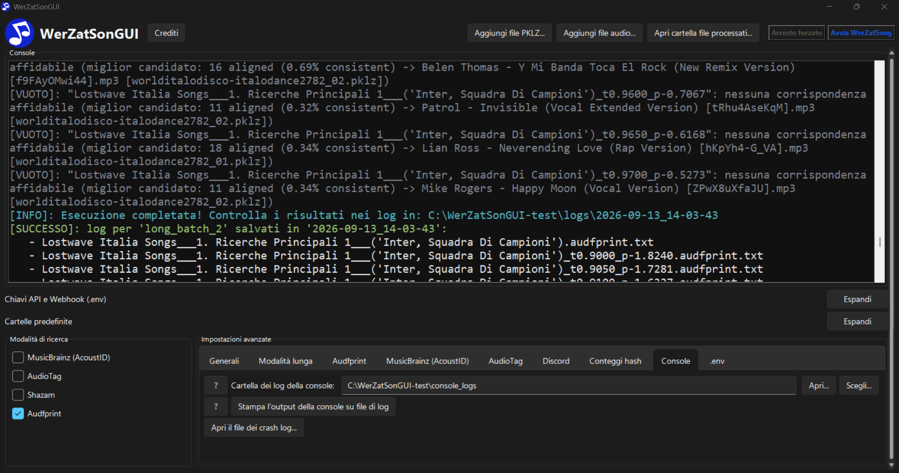
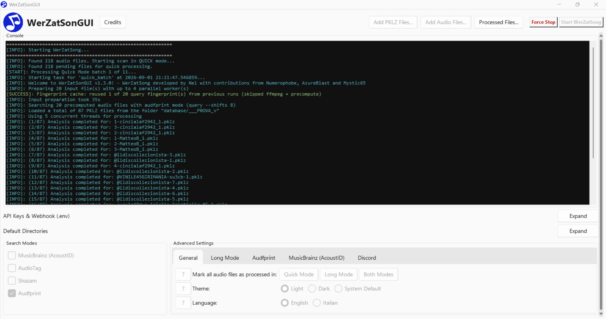
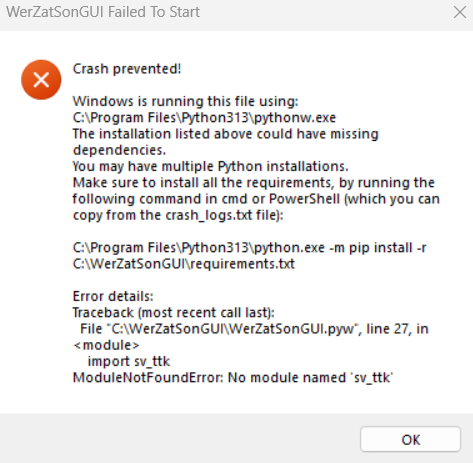
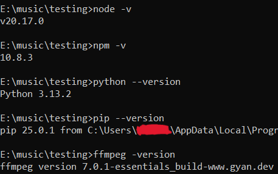
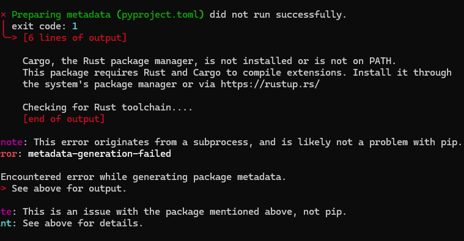
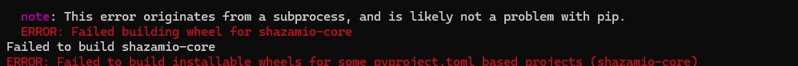
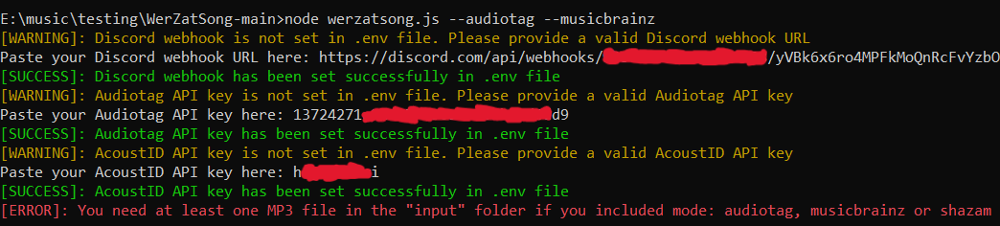
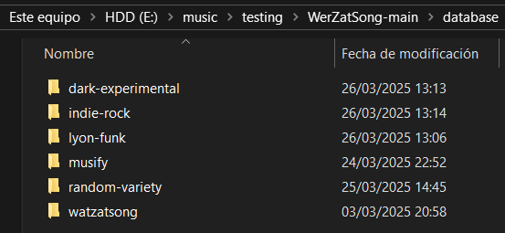

# WerZatSonGUI





(NOTA: esta é uma tradução W.I.P. gerada por IA, feita pelo desenvolvedor, que não fala português. A tradução está atualmente aguardando revisão por falantes de português).

**WerZatSonGUI** é um aplicativo de desktop para Windows x64 que coloca uma interface gráfica completa sobre o [**WerZatSong**](https://github.com/Nel80s/WerZatSong), a ferramenta original de busca de músicas por linha de comando. Se você já usou o WerZatSong antes, este aplicativo funciona essencialmente da mesma forma, apenas sem a necessidade de abrir manualmente um terminal e digitar comandos. Consulte [*🌟 Funcionalidades*](#-funcionalidades) para mais informações.

Este documento explica como instalar o WerZatSonGUI, configurá-lo pela primeira vez e usar todas as partes de sua interface.
> **For English speakers**: a full English translation of this document is available in [**README.md**](../README.md).

> **Per chi parla italiano**: una traduzione completa di questo documento è disponibile in [**README_ITA.md**](README_ITA.md).

> **Pour les francophones**: une traduction intégrale de ce document est disponible dans [**README_FRA.md**](README_FRA.md).

## Tabela de Conteúdos

**Informações Gerais:**
- [🚀 Guia de Configuração Rápida](#-guia-de-configura%C3%A7%C3%A3o-r%C3%A1pida)
- [🌟 Funcionalidades](#-funcionalidades)

**Guias (Configuração):**
- [Requisitos](#requisitos)
- [Instalação](#instala%C3%A7%C3%A3o)
- [Configuração Inicial](#configura%C3%A7%C3%A3o-inicial)
- [Avisos do SmartScreen / Antivírus](#avisos-do-smartscreen--antiv%C3%ADrus)

**Guias (Uso da Interface):**
- [Usando o WerZatSonGUI](#usando-o-werzatsongui)
- [Modos de Busca Explicados](#modos-de-busca-explicados)
- [Executando uma Varredura: Modo Rápido vs. Longo](#executando-uma-varredura-modo-r%C3%A1pido-vs-longo)
- [Arquivos Processados & PROCESSED.txt](#arquivos-processados--processedtxt)
- [Onde Encontrar os Resultados](#onde-encontrar-os-resultados)
- [Formato dos Logs](#formato-dos-logs)

**Como Contribuir com o Projeto:**
- [Adicionando um Idioma / Traduções](#adicionando-um-idioma--tradu%C3%A7%C3%B5es)

**Créditos:**
- [Créditos](#cr%C3%A9ditos)

## 🚀 Guia de Configuração Rápida

### 1️⃣ Se você *já tem* o WerZatSong ou uma versão antiga do WerZatSonGUI:

1. **Baixe** e **extraia em uma pasta vazia** `upgrade_to_GUI.zip`.
2. **Execute** `upgrade_to_GUI.bat` e siga as instruções.
3. **Inicie** o aplicativo.
> Se não conseguir clicar duas vezes diretamente, abra o arquivo `WerZatSonGUI.pyw` com `Python`, `pythonw.exe` ou `pyw.exe`.

4. **Adicione** suas músicas através do botão **Adicionar arquivos de áudio...**.
5. **Adicione** seus arquivos pklz através do botão **Adicionar arquivos PKLZ...**.
6. **Selecione** seus modos de busca preferidos.
7. Clique em **Iniciar o WerZatSong**.

### 2️⃣ Se você é um *novo usuário:*
1. **Baixe** e execute `WerZatSonGUI_Installer.exe`.

2. **Inicie** o instalador e siga as instruções; o assistente fará você instalar o **Visual Studio Build Tools** e o **Rust**, e cuidará automaticamente das outras dependências.
> Certifique-se de selecionar a **carga de trabalho "Desenvolvimento para desktop com C++"** ao instalar o Visual Studio Build Tools. Se você já tem o Visual Studio, **localize** e **edite** sua instalação mais recente do "Visual Studio Build Tools" (V.S.B.T. 2026, em 2026) para adicionar essa opção.


3. (Se o seu PC reiniciar) **Reinicie** o instalador para concluir a instalação das dependências.

4. **Clique duas vezes** no atalho criado na sua Área de Trabalho, ou **execute** `WerZatSonGUI.pyw` na pasta de instalação.

> Se não conseguir clicar duas vezes diretamente, abra o arquivo `WerZatSonGUI.pyw` com `Python`, `pythonw.exe` ou `pyw.exe`.

> Leia [*"Solução de Problemas: Como Corrigir o Erro de Inicialização 'Missing Dependencies' / 'Crash Prevented!'"*](#solu%C3%A7%C3%A3o-de-problemas-como-corrigir-o-erro-de-inicializa%C3%A7%C3%A3o-missing-dependencies--crash-prevented-) se estiver tendo problemas para iniciar o programa.


5. **Insira** seu Webhook do Discord e as chaves de API (AcoustID, AudioTag) quando solicitado.

> Veja [*"Como Obter uma URL de Webhook do Discord"*](#como-obter-uma-url-de-webhook-do-discord) abaixo.

> Veja [*"Como Obter uma Chave de API do AudioTag"*](#como-obter-uma-chave-de-api-do-audiotag) abaixo.

> Veja [*"Como Obter uma Chave de API do AcoustID (MusicBrainz)"*](#como-obter-uma-chave-de-api-do-acoustid-musicbrainz) abaixo.


6. **Adicione** suas músicas através do botão **Adicionar arquivos de áudio...**.
7. **Adicione** seus arquivos pklz através do botão **Adicionar arquivos PKLZ...**.
8. **Selecione** seus modos de busca preferidos.
9. Clique em **Iniciar o WerZatSong**.

## 🌟 Funcionalidades
- Todos os comandos do [**WerZatSong**](https://github.com/Nel80s/WerZatSong) são suportados: os 4 modos de busca (**MusicBrainz (AcoustID), AudioTag, Shazam** e **Audfprint**) estão presentes, e qualquer número deles pode ser combinado em uma única varredura.
- Suporte para **bancos de dados de músicas inteiros** graças a um **motor de varredura em lote**, que permite adicionar quantos arquivos de áudio você quiser ao programa: ele irá automaticamente varrer no máximo 20-30 por vez, da forma mais eficiente possível (veja [*Executando uma Varredura: Modo Rápido vs. Longo*](#executando-uma-varredura-modo-r%C3%A1pido-vs-longo) abaixo). Links para os bancos de dados comunitários [Lostwave Italia](https://drive.google.com/drive/folders/1S0Tj-PrdKzUc1jZ4c2feUGcyBABLdaEy), [French Lostwaves](https://drive.google.com/drive/folders/1NLVjBYXNdWy_kxp21Npds6T3F6QpA520) e [@user-QLostwave (Q)](https://drive.google.com/drive/folders/1dlU0MmdcwzYXB_LqYz9KZdokD7lO5ZMW) estão incluídos no programa na seção **Adicionar arquivos de áudio...**.
- Um script embutido por **Mystic65**, que pode gerar e buscar automaticamente dezenas de **variações de tempo/afinação** de cada arquivo, para ajudar a capturar músicas que foram aceleradas, desaceleradas ou tiveram a afinação alterada (veja [*Executando uma Varredura: Modo Rápido vs. Longo*](#executando-uma-varredura-modo-r%C3%A1pido-vs-longo) abaixo).
- Um **rework da base do WerZatSong** e um **rework dos logs** (veja [*Formato dos Logs*](#formato-dos-logs) abaixo) por **EierkuchenHD.**
- Uma nova seção **Arquivos processados...**. Se você tem uma quantidade significativa de músicas em sua pasta de entrada, agora pode decidir facilmente quais deseja executar com o WerZatSonGUI, **sem** ter que mover nada para fora dessa pasta (veja [*Arquivos Processados & PROCESSED.txt*](#arquivos-processados--processedtxt) abaixo).
- Suporte para **vários idiomas** e **traduções.** Atualmente, os idiomas suportados são português, inglês, italiano e francês (veja [*Adicionando um Idioma / Traduções*](#adicionando-um-idioma--tradu%C3%A7%C3%B5es) abaixo).
- Suporte para modos **claro** e **escuro**.

## Requisitos

O WerZatSonGUI atualmente é **suportado apenas no Windows x64** (ele depende de recursos específicos do Windows, como abrir pastas no Explorador de Arquivos e gerar janelas de console nativas).

> **Nota:** Você **não** precisa instalar nada disso sozinho! O instalador descrito abaixo cuida do Node.js, Python e FFmpeg de forma totalmente automática usando o **WinGet** (verificando corretamente se estão instalados *e* se atendem à versão mínima acima, atualizando-os se uma cópia antiga for encontrada), e orienta você na instalação do Rust e das Ferramentas de Compilação C++ (veja abaixo o porquê).
Os requisitos são listados aqui apenas para que o usuário saiba o que acontece durante a instalação e para o caso excepcional de falha na instalação de um deles (veja *"Se o Instalador Não Funcionar"* abaixo).

Os requisitos são os mesmos que o WerZatSong original precisa para funcionar:

- [**Node.js**](https://nodejs.org) (v20.0 ou superior)
- [**Python**](https://www.python.org/downloads) (v3.13 ou superior)
- [**FFmpeg**](https://www.gyan.dev/ffmpeg/builds)
- **Rust** e as **Ferramentas de Compilação C++** (necessários apenas para corrigir alguns erros ao compilar algumas dependências Python). Qualquer versão do Visual Studio de **2017 em diante** funciona, desde que sua carga de trabalho **"Desenvolvimento para desktop com C++"** (as Ferramentas de Compilação C++ reais) esteja instalada; uma instalação completa da *IDE* do Visual Studio não é necessária e não é detectada como substituta se a carga de trabalho C++ estiver ausente.

Antes da sua primeira varredura, você também vai querer:

- Uma **URL de Webhook do Discord**, para receber notificações de correspondências (veja *"Como Obter uma URL de Webhook do Discord"* abaixo)
- Uma **chave de API do AudioTag**, necessária para o modo de busca AudioTag (veja *"Como Obter uma Chave de API do AudioTag"* abaixo)
- Uma **chave de API do AcoustID**, necessária para o modo de busca MusicBrainz (veja *"Como Obter uma Chave de API do AcoustID (MusicBrainz)"* abaixo)
- Um **banco de dados de fingerprints do Audfprint** (arquivos `.pklz`), necessário para o modo de busca Audfprint. Você pode baixar a maioria dos arquivos de banco de dados pklz feitos pela comunidade em [**aqui.**](https://wzs.cosine.club)
  - **Nota**: Esses bancos de dados podem ocupar muito espaço em disco (até centenas de gigabytes); um SSD é recomendado para bom desempenho se você pretende baixar todos os arquivos de banco de dados disponíveis. Felizmente, para algumas buscas, usar apenas alguns arquivos pklz que cobrem as fontes corretas (mesmo gênero, mesmos anos, etc.) pode ser igualmente eficaz, por isso é recomendável verificar os nomes dos arquivos pklz e descobrir quais podem ser úteis para suas buscas.

## Instalação

### Recomendado (se você nunca teve o WerZatSong antes): Use o Instalador

1. Baixe `WerZatSonGUI_Installer.exe` e execute-o
2. Se a instalação do Windows estiver definida para um idioma diferente do português ou de outro idioma suportado, o instalador pedirá que você escolha um deles para o próprio assistente; o idioma da interface do aplicativo é então automaticamente definido para corresponder depois (você pode alterá-lo a qualquer momento nas **Configurações avançadas**, veja [*aba Geral*](#aba-geral) abaixo)
3. Na próxima página, você pode escolher se deseja criar um **atalho na área de trabalho** (marcado por padrão) junto com a entrada usual do Menu Iniciar
4. O instalador irá automaticamente:
   - Detectar uma instalação existente do Visual Studio C++ Build Tools (2017 ou mais recente) e do Rust, e ignorá-las se já estiverem presentes
   - Se alguma estiver faltando, abrir a página oficial de download correta para sua versão do Windows e pausar, pedindo que você conclua essa instalação antes de continuar (veja *"Por que algumas instalações não são totalmente automáticas"* abaixo). **Assim que uma das duas instalações terminar, você terá que ir para a tela do PowerShell aberta para a instalação e pressionar ENTER manualmente para continuar.**
   - Instalar Node.js, Python 3.13 e FFmpeg se ainda não estiverem no seu sistema, ou atualizá-los se uma cópia existente estiver abaixo da versão mínima exigida (via WinGet)
   - Executar `npm install`
   - Executar `pip install -r requirements.txt`
   - Instalar o pip e todos os pacotes Python necessários
   - Iniciar o WerZatSonGUI assim que tudo estiver pronto

Assim que a instalação terminar, o WerZatSonGUI abre e o guia pela [**Configuração Inicial**](#configura%C3%A7%C3%A3o-inicial) abaixo.
Pode ser que você seja solicitado a reiniciar o computador (isso pode acontecer após a instalação do C++ Build Tools ou do Rust): se isso acontecer, é completamente seguro executar `WerZatSonGUI_Installer.exe` novamente quando você voltar: tudo o que já foi instalado será detectado e ignorado automaticamente.
Quando o computador reiniciar e a instalação terminar, você pode usar o atalho da área de trabalho/menu Iniciar criado acima ou ir para a pasta onde escolheu instalar o programa e clicar duas vezes no arquivo `WerZatSonGUI.pyw` para iniciar a Configuração Inicial diretamente. Se não conseguir clicar duas vezes, abra o arquivo `WerZatSonGUI.pyw` com `pythonw.exe` ou `pyw.exe`.

#### Por que algumas instalações não são totalmente automáticas, mas guiadas

O Visual Studio Build Tools e o Rust são ambos intencionalmente **não** instalados silenciosamente em segundo plano. O Visual Studio Build Tools em particular é uma instalação grande e lenta, e as versões anteriores deste instalador não conseguiam detectar de forma confiável uma instalação existente, então acabavam reinstalando (e baixando novamente centenas de componentes) a cada execução, mesmo quando já estavam presentes. Instalá-lo (e o Rust) agora abre o instalador oficial correto para sua versão do Windows no navegador e simplesmente aguarda você confirmar quando terminar, o que é mais lento para clicar, mas muito mais previsível e muito menos propenso a falhar silenciosamente ou inchar de tamanho.

#### Solução de Problemas: Como Corrigir o Erro de Inicialização "Missing Dependencies" / "Crash Prevented!"



Se você usou o instalador do WerZatSonGUI e está recebendo um erro de travamento ao tentar iniciar o programa (como o mostrado acima), isso geralmente significa que o Visual Studio Build Tools não foi instalado corretamente.
Esse é um problema conhecido e uma correção muito fácil!

##### Passo 1: Salve sua Mensagem de Erro

Mantenha a janela de erro aberta ou abra seu arquivo `crash_logs.txt`. Certifique-se de anotar em algum lugar tudo o que a janela de erro disse. Você precisará procurar um comando específico dessa mensagem de erro no *Passo 5.*

##### Passo 2: Instale o Visual Studio Build Tools

> **Nota Importante:** Se o seu computador estiver configurado para um idioma diferente do português, os botões e opções deste instalador estarão no seu idioma local! Basta procurar as opções que *traduzem* os termos em português abaixo.

1. Baixe o instalador oficial aqui: [Visual Studio Build Tools](https://aka.ms/vs/stable/vs_BuildTools.exe)
2. Abra o instalador. Se você vir uma lista de programas diferentes, role até encontrar **Visual Studio Build Tools 2026** (ou a versão mais recente).
3. Clique no botão **Modificar** (ou **Editar**) ao lado.
4. Uma janela com várias opções aparecerá. Olhe no canto superior esquerdo e marque a caixa que diz **Desenvolvimento para desktop com C++** ou algo parecido. *(Nota: Você não precisa marcar outras opções).*
5. Clique em **"Instalar"** no canto inferior direito e aguarde a conclusão.

##### Passo 3: Reinicie o Computador
Assim que a instalação estiver completamente concluída, reinicie o PC para garantir que as alterações sejam aplicadas.

##### Passo 4: Abra o Prompt de Comando como Administrador
1. Clique na barra de pesquisa do Windows na parte inferior da tela e digite `cmd`.
2. Clique com o botão direito em **Prompt de Comando** e selecione **Executar como administrador**.

##### Passo 5: Execute o Comando de Correção
Agora, volte à mensagem de erro do Passo 1. Você verá uma linha de texto parecida com isto:
`"C:\Program Files\Python313\python.exe" -m pip install -r C:\WerZatSonGUI\requirements.txt`

Basta copiar e colar essa linha, `"C:\Program Files\Python313\python.exe" -m pip install -r C:\WerZatSonGUI\requirements.txt`, na janela do cmd e pressionar **Enter**.

Depois disso, deixe carregar e terminar.
Assim que terminar, feche a janela e execute o WerZatSonGUI: agora funcionará.

### Recomendado (se você já tem o WerZatSong ou uma versão antiga do WerZatSonGUI instalada): upgrade_to_GUI.zip

Se preferir não executar o instalador (por exemplo, para evitar o aviso do SmartScreen descrito em [*Avisos do SmartScreen / Antivírus*](#avisos-do-smartscreen--antiv%C3%ADrus) abaixo) e já tiver o **WerZatSong** de linha de comando original ou uma cópia antiga do **WerZatSonGUI** instalada e funcionando, não precisa reinstalar tudo do zero. Nas releases, você encontrará `upgrade_to_GUI.zip`. Extraia esse arquivo em uma pasta vazia e execute `upgrade_to_GUI.bat`: ele cuidará dos dois casos automaticamente, já que quase tudo o que precisa (Node.js, Python, Rust, C++ Build Tools, FFmpeg) já está no seu sistema.

Clique duas vezes e ele irá:

1. Pedir que você escolha o português (ou outro idioma suportado) para suas próprias mensagens
2. Pedir o caminho completo para sua pasta existente do WerZatSong/WerZatSonGUI (a função "Copiar endereço como texto" do Explorador funciona bem aqui, aspas e barra invertida final são tratadas automaticamente)
3. Detectar qual situação se aplica, mostrar exatamente o que está prestes a fazer e pedir confirmação antes de tocar em qualquer coisa:
   - **Uma instalação legada do WerZatSong sem GUI** (um `werzatsong.js` diretamente na pasta, sem `WerZatSonGUI.pyw`): ele reestrutura a pasta para você, movendo tudo o que está lá atualmente para uma nova subpasta `assets`, movendo `assets\logs` de volta para `logs` e movendo o conteúdo de `assets\input` para `db_inputs\legacy_werzatsong_input` (assim, qualquer coisa que você tenha enfileirado anteriormente não é perdida, apenas realocada para onde o WerZatSonGUI espera que os arquivos de entrada adicionados manualmente residam)
   - **Uma instalação existente do WerZatSonGUI** (um `WerZatSonGUI.pyw` já dentro da pasta): ele a atualiza no lugar, sem reestruturar nada
4. De qualquer forma, ele substitui todo o conteúdo da pasta `assets` (`werzatsong.js` e tudo em `utils`, `scripts`, `libs`, `resources`, `images`, `localizations`, etc.) pela versão atual e copia os arquivos mais recentes `WerZatSonGUI.pyw`, `requirements.txt` e `package.json`. **Seus `assets\database` (impressões digitais pklz) e `assets\.env` (chaves de API/webhook) nunca são tocados ou excluídos**, já que nenhum deles faz parte do pacote copiado
   - Ao migrar uma instalação legada, o `config.json` também é copiado pela primeira vez (ainda não há configuração de GUI existente para preservar)
   - Ao atualizar uma instalação existente do WerZatSonGUI, **o `config.json` é deliberadamente deixado intacto**, para que seus diretórios, tema e idioma permaneçam exatamente como você os deixou; o script também limpa qualquer arquivo remanescente no estilo `advanced_settings_explainations.json` de `assets`, um arquivo antigo de explicação de configurações anterior à localização que é totalmente substituído pela pasta `assets\localizations` (veja [*Adicionando um Idioma / Traduções*](#adicionando-um-idioma--tradu%C3%A7%C3%B5es) abaixo) e que de outra forma permaneceria sem uso
5. Executa `pip install -r requirements.txt` para você
6. Cria (ou atualiza) um atalho de área de trabalho **WerZatSonGUI** apontando para a pasta, exatamente como o atalho do instalador

Assim que terminar, use esse atalho (ou clique duas vezes diretamente em `WerZatSonGUI.pyw` dentro da pasta) para iniciar o aplicativo. Se não conseguir clicar duas vezes no arquivo ou usar o atalho diretamente, abra o arquivo `WerZatSonGUI.pyw` com `pythonw.exe` ou `pyw.exe`. Se uma varredura reclamar de um módulo Node ausente depois, abra um terminal nessa pasta e execute `npm install` uma vez.

### Se o Instalador Não Funcionar

Se uma etapa do instalador automático falhar, você pode instalar tudo manualmente:

1. **Instale Node.js, Python e FFmpeg** manualmente a partir dos links em [Requisitos](#requisitos), certificando-se de que cada um seja adicionado ao `PATH` do seu sistema. Verifique se instalaram corretamente (e atendem às versões mínimas acima) abrindo um terminal na pasta do WerZatSonGUI e executando:

    ```bash
    node -v
    npm -v
    python --version
    pip --version
    ffmpeg -version
    ```

    Você deverá ver os números de versão de cada um, semelhante a isto:

    

2. **Instale as dependências do Node.js**:

    ```bash
    npm install
    ```

3. **Instale as dependências do Python**, um comando de cada vez:

    ```bash
    pip install -r requirements.txt
    pip install audioop-lts
    pip install shazamio
    ```

    - **Nota**: Se você encontrar um erro durante a instalação dessas dependências, pode ser devido a dependências ausentes. Aqui estão dois problemas comuns e suas soluções:
        - **Erro de Rust** (veja a captura de tela abaixo):
            - Instale o Rust no [site oficial](https://www.rust-lang.org/tools/install) (ou diretamente pelo [download do rustup-init.exe](https://static.rust-lang.org/rustup/dist/x86_64-pc-windows-msvc/rustup-init.exe))
            - Após a instalação, verifique se funciona executando `rustc --version` no terminal
            - Assim que o Rust estiver instalado, tente novamente os comandos `pip install` acima
            
        - **Erro de Ferramentas de Compilação C++** (veja a captura de tela abaixo):
            - Instale o Visual Studio C++ Build Tools: no **Windows 11**, use a [versão atual](https://aka.ms/vs/stable/vs_BuildTools.exe); no **Windows 10**, use o [Visual Studio 2022 Build Tools](https://aka.ms/vs/17/release/vs_buildtools.exe) (a versão mais recente ainda suportada lá). Qualquer versão a partir de 2017 funciona da mesma forma, este é apenas o link de download atual
            - Durante a instalação, selecione a carga de trabalho *"Desenvolvimento para desktop com C++"*. O resto do Visual Studio em si não é necessário
            - Após a instalação, reinicie a máquina
            - Tente novamente os comandos `pip install` acima
            

4. **Baixe o código-fonte** clicando em `<> Code` -> `Download ZIP` e extraia o arquivo ZIP com o código-fonte onde preferir. Os seguintes arquivos/pastas podem ser excluídos, pois são usados apenas pelo instalador:
	```
	get_pip.py
	setup.iss
	setup_deps.ps1
	Pasta Languages
	Pasta output
    Pasta _upgrade_script
	```

5. **Inicie o WerZatSonGUI** clicando duas vezes em `WerZatSonGUI.pyw` (ou executando `pythonw WerZatSonGUI.pyw` a partir de um terminal nessa pasta)

## Configuração Inicial

Na primeira vez que você iniciar o WerZatSonGUI, ele percebe que nenhum arquivo `.env` existe ainda em sua pasta `assets` e muda para uma pequena janela de configuração em vez de mostrar a interface completa:

1. Ele primeiro verifica se as pastas `db_inputs` e `assets\input` estão ambas vazias. Se alguma já contiver arquivos, você receberá uma mensagem de erro pedindo para esvaziá-las e reiniciar: esta é uma verificação de segurança para garantir que nada seja processado acidentalmente antes que a configuração termine.
2. Ele executa `npm install` em sua própria janela de terminal, fechando-a automaticamente quando termina.
3. Ele executa `pip install -r requirements.txt` em sua própria janela de terminal, fechando-a automaticamente quando termina.
4. Em seguida, ele abre uma segunda janela de terminal que pergunta, um de cada vez, sua **URL de Webhook do Discord**, sua **chave de API do AudioTag** e sua **chave de API do AcoustID**:

    

    Cole cada valor quando solicitado e pressione Enter. Se algo que você inserir for rejeitado (uma chave ou webhook inválido), o WerZatSonGUI reabrirá este terminal automaticamente para que você possa tentar novamente: não é necessário reiniciar o aplicativo inteiro.
5. Uma vez que as três sejam aceitas, elas são salvas em `assets\.env` e o WerZatSonGUI se reinicia automaticamente na interface completa.

### Como Obter uma URL de Webhook do Discord

Seu webhook do Discord é onde o WerZatSonGUI envia uma notificação (com detalhes e, para alguns modos de busca, um arquivo de resultados) toda vez que uma varredura encontra uma correspondência provável.

1. Abra o Discord e crie seu próprio servidor (*se* você ainda não tiver um para usar)
2. Vá para qualquer canal de texto (por exemplo, **#general**). Clique no ícone de engrenagem (⚙️) ao lado do nome para abrir o menu **Editar Canal**
3. Vá para **Integrações → Webhooks**
4. Clique em **Criar Webhook**, depois abra-o e selecione **Copiar URL do Webhook**
5. Cole essa URL quando o WerZatSonGUI solicitar durante a configuração (ou depois, na seção **Chaves de API e Webhook (.env)** da interface principal)

Você pode, opcionalmente, dar a este webhook um nome de exibição e imagem de avatar personalizados diretamente da **aba Discord** das **Configurações Avançadas** do WerZatSonGUI (veja [*Usando o WerZatSonGUI*](#usando-o-werzatsongui) abaixo).

### Como Obter uma Chave de API do AudioTag

Essa chave é necessária para usar o modo de busca **AudioTag**.

1. Acesse o site [AudioTag](https://audiotag.info) e *crie uma nova conta* (ou *faça login*, se já tiver uma)
2. Vá para sua [**Seção de Usuário**](https://user.audiotag.info) e abra a aba **Chaves de API**
3. Clique em **Criar nova chave de API** e copie-a
4. Cole essa chave quando o WerZatSonGUI solicitar durante a configuração (ou depois, na seção **Chaves de API e Webhook (.env)** da interface principal)

### Como Obter uma Chave de API do AcoustID (MusicBrainz)

Essa chave é necessária para usar o modo de busca **MusicBrainz (AcoustID)**.

1. Acesse o site [AcoustID](https://acoustid.org) e *crie uma nova conta* (ou *faça login*, se já tiver uma)
2. Vá para [**Meus Aplicativos**](https://acoustid.org/my-applications) e clique em **Registrar um novo aplicativo**
3. Preencha os campos com informações básicas (pode ser aleatório) e clique em **Registrar**
4. Copie a **chave de API** do aplicativo que aparece
5. Cole essa chave quando o WerZatSonGUI solicitar durante a configuração (ou depois, na seção **Chaves de API e Webhook (.env)** da interface principal)

### Configurando o Banco de Dados do Audfprint

Se você planeja usar o modo de busca **Audfprint**, pode baixar as pastas de banco de dados feitas pela comunidade (contendo arquivos de impressão digital `.pklz`) em [**aqui**](https://wzs.cosine.club) e colocá-las dentro do seu **Diretório do Banco de Dados do Audfprint**: solte-as pelo botão **Abrir...** ao lado na seção **Diretórios** ou use o botão **Adicionar arquivos PKLZ...** na parte inferior da janela (que também tem um link **Banco de dados público do PKLZ...** que leva direto ao mesmo site). Cada pasta de nível superior atua como sua própria coleção independente de impressões digitais (por exemplo, dividida por gênero ou fonte):



Você pode restringir posteriormente uma varredura a apenas uma dessas subpastas usando **"Usar apenas fingerprints deste subdiretório"** nas **Configurações Avançadas**.

## Avisos do SmartScreen / Antivírus

Como `WerZatSonGUI_Installer.exe`, `setup_deps.ps1` e `WerZatSonGUI.pyw` não são assinados com um certificado de assinatura de código pago (o que custaria um valor que não posso pagar), o Windows SmartScreen e alguns mecanismos antivírus podem sinalizá-los como vindo de um "Editor desconhecido" ou até mesmo colocá-los em quarentena. Isso é uma heurística de confiança/reputação baseada em quão novo e quão amplamente distribuído é um arquivo, **não** um sinal de que algo seja realmente malicioso. É um efeito colateral bem conhecido de software Windows distribuído de forma independente em geral, e certificados de assinatura de código não são algo que um projeto gratuito/open-source de hobby normalmente pode obter, então este aviso deve continuar aparecendo independentemente de qualquer alteração feita nos scripts.

Se você vir um diálogo **"O Windows protegeu seu PC"** após baixar `WerZatSonGUI_Installer.exe`:

1. Clique em **Mais informações**
2. Clique no botão **Executar mesmo assim** que aparece

Se o seu antivírus colocar em quarentena ou excluir `setup.iss`, `setup_deps.ps1`, `upgrade_to_GUI.bat` ou `WerZatSonGUI.pyw` em vez de apenas avisar sobre eles, restaure o arquivo da quarentena (ou baixe/extraia novamente) e adicione uma exclusão para a pasta do WerZatSonGUI se o seu antivírus permitir.

Se você preferir contornar totalmente o instalador sinalizado e já tiver uma instalação funcional do WerZatSong ou WerZatSonGUI, veja [*Recomendado (se você já tem o WerZatSong ou uma versão antiga do WerZatSonGUI instalada): upgrade_to_GUI.zip*](#recomendado-se-voc%C3%AA-j%C3%A1-tem-o-werzatsong-ou-uma-vers%C3%A3o-antiga-do-werzatsongui-instalada-upgrade_to_gui.zip) acima. O `upgrade_to_GUI.bat` reutiliza sua instalação existente de Node.js/Python/Rust/C++ Build Tools/FFmpeg e nunca precisa tocar no WinGet ou nos instaladores guiados do Visual Studio/Rust.

## Usando o WerZatSonGUI

Assim que a configuração estiver concluída, o WerZatSonGUI abre sua interface completa toda vez que você o inicia. Tanto no modo janela quanto maximizado/tela cheia, a barra de ação superior (**Adicionar arquivos PKLZ...**, **Adicionar arquivos de áudio...**, **Arquivos processados...**, **Parar à força**, **Iniciar o WerZatSong**) permanece sempre visível e acessível. Se o resto da interface não couber no espaço disponível (por exemplo, com **Chaves de API e Webhook** e **Diretórios** expandidos em uma tela menor), a seção acima da barra de ação rola em vez de empurrá-la para fora da tela.

### Cabeçalho

O logotipo e o título no canto superior esquerdo, e um botão **Créditos** que abre um pequeno pop-up creditando todos que trabalharam no WerZatSonGUI, no script de varredura em lote e no projeto original WerZatSong.

### Console

Uma visão de terminal ao vivo. Sempre que o WerZatSonGUI executa um comando em segundo plano (durante a configuração ou enquanto uma varredura está em execução), sua saída aparece aqui em tempo real. Você pode ampliar e reduzir o texto a qualquer momento com **Ctrl + Rolagem**, **Ctrl + Mais/Menos**, ou redefini-lo para o tamanho padrão com **Ctrl + 0**, útil para ler uma tela pequena ou um fluxo denso de linhas de log. Isso nunca interfere na rolagem normal do console ou em qualquer outro atalho de teclado.

### Chaves de API e Webhook (.env)

Mostra sua **Chave de API do AcoustID**, **Chave de API do AudioTag** e **Webhook do Discord**, cada uma oculta atrás de um botão **Mostrar...** para que não fiquem visíveis na tela por padrão. Clique em **Mostrar...** para revelar e editar um valor, ou **Ocultar...** para ocultá-lo novamente. Qualquer alteração feita aqui é salva imediatamente em `assets\.env`, a menos que uma varredura esteja em execução, caso em que é aplicada automaticamente no momento em que a varredura termina.

### Diretórios Padrão

- **Diretório de Entrada:** onde você coloca todos os arquivos de áudio que deseja que o WerZatSonGUI varra (padrão é uma pasta `db_inputs` ao lado do aplicativo). Isso é **separado** da pasta interna `assets\input` do WerZatSong, que o WerZatSonGUI gerencia automaticamente nos bastidores durante uma varredura.
- **Diretório do Banco de Dados do Audfprint:** onde ficam suas pastas de banco de dados de impressões digitais `.pklz` (veja [*Configurando o Banco de Dados do Audfprint*](#configurando-o-banco-de-dados-do-audfprint)).
- **Diretório de Logs:** onde os logs de resultados são salvos após cada varredura (veja [*Onde Encontrar os Resultados*](#onde-encontrar-os-resultados) e [*Formato dos Logs*](#formato-dos-logs) abaixo).

Cada linha tem um botão **Abrir...** (abre aquela pasta no Explorador de Arquivos, criando-a antes se não existir) e um botão **Procurar...** (permite escolher uma pasta diferente para usar). Esta seção inteira fica acinzentada enquanto uma varredura está em execução.

### Modos de Busca

Quatro caixas de seleção para ativar ou desativar **MusicBrainz (AcoustID)**, **AudioTag**, **Shazam** e **Audfprint** (veja [*Modos de Busca Explicados*](#modos-de-busca-explicados) abaixo para saber o que cada um faz). Você pode ativar qualquer combinação; quando mais de um está marcado, eles sempre executam nesta ordem fixa:

1. **MusicBrainz** (AcoustID)
2. **AudioTag**
3. **Shazam**
4. **Audfprint**

### Configurações Avançadas

Dividido em cinco abas para agrupar configurações relacionadas. Cada configuração individual tem um pequeno botão **[?]** à esquerda com uma breve explicação, e esta seção também resume o que cada uma faz. Todo este painel fica acinzentado enquanto uma varredura está em execução.

#### Aba Geral

- **Marcar todos os arquivos de áudio como processados em:** Útil se você tem muitos arquivos na pasta de entrada e deseja executar apenas alguns específicos. Marca todos os arquivos de áudio da pasta de entrada como **processados** no modo **Rápido** (sem geração adicional de tempo), no modo **Longo** (arquivos originais e tempos adicionais) ou em **ambos** os modos, para que você possa excluir manualmente as linhas das músicas que não deseja executar editando o **PROCESSED.txt.** Pressionar qualquer um dos 3 botões **sobrescreve** seu arquivo PROCESSED.txt atual (veja [*Arquivos Processados & PROCESSED.txt*](#arquivos-processados--processedtxt) abaixo).
- **Tema:** Altera a aparência visual do aplicativo. Defina como **Claro**, **Escuro** ou **Padrão do sistema** para corresponder automaticamente às configurações do seu sistema operacional.
- **Idioma:** Alterna a interface entre **Português** e outro idioma suportado. Tem efeito imediato, sem necessidade de reiniciar (veja [*Adicionando um Idioma / Traduções*](#adicionando-um-idioma--tradu%C3%A7%C3%B5es) abaixo se quiser ajudar a adicionar mais).

#### Aba Modo Longo

- **Ativar Modo Longo (gerar velocidades/tempos diferentes para cada arquivo de áudio):** alterna as varreduras entre o modo **Rápido** e **Longo**. Veja [*Executando uma Varredura: Modo Rápido vs. Longo*](#executando-uma-varredura-modo-r%C3%A1pido-vs-longo) abaixo.
- **Multiplicadores de tempo negativos** / **Multiplicadores de tempo positivos:** as proporções de tempo usadas para gerar variações no modo Longo (negativo = desacelerado/afinação mais grave, abaixo de `1.0`; positivo = acelerado/afinação mais aguda, acima de `1.0`). Edite-os como uma lista separada por vírgulas entre colchetes, por exemplo, `[0.9, 0.95, 1.05, 1.1]`. Deixar **um** campo vazio (ou `[]`) faz o WerZatSonGUI gerar variações apenas do outro arranjo; deixar **ambos** vazios restaura o conjunto padrão completo de 40 variações (20 negativas + 20 positivas).

#### Aba Audfprint

- **Usar apenas fingerprints deste subdiretório:** restringe o modo Audfprint a uma única subpasta do seu Diretório do Banco de Dados do Audfprint em vez de pesquisar todas. Use **Procurar...** para escolher uma ou digite o nome diretamente (ela já deve existir dentro do Diretório do Banco de Dados do Audfprint).
- **Definir o número de threads da CPU a serem usados:** define quantos threads da CPU o modo Audfprint usa. O próprio WerZatSong limita isso a **16**, independentemente do valor inserido, para evitar falta de memória; deixar desmarcado permite usar automaticamente todos os threads disponíveis na sua máquina.
- **Defina a profundidade de pesquisa como:** controla o quão agressivamente o Audfprint procura por uma correspondência, de `1` a `8`. Valores mais altos realizam uma "busca profunda" mais minuciosa para clipes de baixa qualidade, mas podem aumentar significativamente o tempo de processamento. O padrão é `4`.

#### Aba MusicBrainz

- **Defina o intervalo de duração (em segundos) como:** restringe as correspondências do MusicBrainz a músicas cuja duração esteja entre os dois valores inseridos. Cada valor deve estar entre `30` e `600`; qualquer coisa fora desse intervalo é redefinida para os padrões (`30`/`600`).
- **Defina a extensão inicial (em segundos) como:** ajuda o MusicBrainz a encontrar uma correspondência quando o início do seu arquivo de áudio está cortado ou atrasado, estendendo a janela analisada por esse número de segundos. Deve estar entre `1` e `25`; qualquer coisa fora desse intervalo é redefinida para o padrão (`25`).

#### Aba Discord

- **Use um nome personalizado para o Webhook:** substitui o nome de exibição que seu webhook do Discord usa ao postar, em vez do padrão "WerZatSong".
- **Use uma imagem personalizada para o Webhook:** substitui a imagem de avatar que seu webhook do Discord usa ao postar. O link deve começar com `https://cdn.discordapp.com/icons/`, `https://cdn.discordapp.com/app-icons/` ou `https://cdn.discordapp.com/avatars/`, caso contrário o Discord não o reconhecerá. A imagem deve estar no formato `.webp`. Você pode obter um link formatado corretamente definindo a imagem como foto de perfil de um bot do Discord e copiando o link de lá (se necessário, removendo qualquer parâmetro de tamanho no final e alterando a extensão para `.webp`).

### Adicionando Arquivos para Varredura

Use **Adicionar arquivos de áudio...** na parte inferior da janela para adicionar as músicas que deseja buscar, escolhendo arquivos individuais ou uma pasta inteira. O WerZatSonGUI aceita arquivos `.mp3`, `.wav`, `.flac` e `.m4a`. Qualquer arquivo que não seja `.mp3` é **automaticamente convertido** para MP3 VBR de mais alta qualidade que o FFmpeg pode produzir no momento em que a varredura começa.

> **AVISO: Esta conversão SUBSTITUI o arquivo original.** 
> Uma vez que um `.wav`/`.flac`/`.m4a` é convertido, apenas o `.mp3` resultante permanece em sua pasta de entrada. Mantenha uma cópia em outro lugar antes se quiser preservar o arquivo original com codificação sem perdas (ou codificado de forma diferente). A conversão é segura contra travamentos (uma execução interrompida nunca deixa um arquivo parcialmente convertido ou ausente; ela simplesmente tenta novamente de forma limpa na próxima vez), mas é unidirecional.

## Modos de Busca Explicados

- **MusicBrainz (AcoustID):** calcula uma impressão digital acústica do arquivo (via `fpcalc`) e a compara com o banco de dados [AcoustID](https://acoustid.org)/MusicBrainz, mantendo apenas resultados acima de um escore mínimo de confiança. Requer uma **chave de API do AcoustID**.
- **AudioTag:** envia o arquivo para a API do [AudioTag.info](https://audiotag.info) e retorna qualquer correspondência que encontrar. Requer uma **chave de API do AudioTag**.
- **Shazam:** identifica o arquivo da mesma forma que o aplicativo Shazam, usando a biblioteca Python `shazamio`. Não requer chave, mas é deliberadamente limitado por taxa (uma curta pausa entre arquivos) para evitar acionar a detecção de abuso do Shazam.
- **Audfprint:** compara o arquivo com seus próprios bancos de dados locais de impressões digitais `.pklz` em vez de um serviço online (veja [*Configurando o Banco de Dados do Audfprint*](#configurando-o-banco-de-dados-do-audfprint)). O único modo que funciona totalmente offline depois que seus bancos de dados são baixados, e o principal que se beneficia das variações de tempo/afinação do **Modo Longo**, pois é sensível o suficiente a elas.

## Executando uma Varredura: Modo Rápido vs. Longo

- **Modo Rápido** (o padrão) pesquisa cada arquivo pendente exatamente como está, sem gerar variações.
- **Modo Longo** gera primeiro variações de tempo/afinação de cada arquivo (veja a **aba Modo Longo** acima) e depois pesquisa também cada variação. Muito mais minucioso, porém muito mais lento, pois efetivamente varre dezenas de arquivos extras por música.

De qualquer forma, o WerZatSonGUI nunca entrega a lista inteira de arquivos ao mecanismo subjacente de uma só vez: o próprio WerZatSong tem um **limite rígido de 30 arquivos por pesquisa**, então tudo é dividido em lotes de antemão. Os lotes normalmente têm esse mesmo número, **30 arquivos** (ou, no Modo Longo, 30 variações) por vez.

No Modo Rápido, isso é direto: 45 arquivos pendentes viram uma divisão 30/15.
No Modo Longo, é um pouco mais inteligente, porque o *número de variações por arquivo* não é fixo e raramente divide exatamente por 30: em vez de despachar um lote de 30 seguido por um lote minúsculo de, digamos, 3 variações restantes, o WerZatSonGUI mantém um pool contínuo de variações ainda não pesquisadas entre arquivos e só finaliza o tamanho de um lote quando sabe quanto realmente resta para pesquisar. Concretamente: se o arquivo A produz 33 variações, as primeiras 30 são despachadas assim que ficam prontas, e as 3 restantes são mantidas e combinadas com as primeiras 27 variações geradas para o arquivo B em um segundo lote completo de 30. E assim por diante para quantos arquivos forem necessários, em vez de enviar um lote quase vazio desperdiçado. O limite rígido de 30 arquivos ainda é tecnicamente respeitado internamente pela lógica do programa, mas você não precisa mais se preocupar com isso.

## Arquivos Processados & PROCESSED.txt

Cada arquivo que o WerZatSonGUI termina de pesquisar (no Modo Rápido, no Modo Longo ou em ambos, dependendo de qual(is) modo(s) ele executou) é registrado como uma linha no `PROCESSED.txt`, na raiz da pasta do WerZatSonGUI, para que executar novamente uma varredura mais tarde nunca pesquise o mesmo arquivo duas vezes no mesmo modo. Cada linha é o caminho relativo do arquivo dentro do seu Diretório de Entrada, opcionalmente com o sufixo `|quick` ou `|long` se ele foi processado apenas em um modo específico em vez de ambos.

Você pode editar livremente esse arquivo à mão: exclua uma linha (ou o arquivo inteiro) para fazer o WerZatSonGUI pesquisá-lo novamente na próxima vez, ou use **Marcar todos os arquivos de áudio como processados em** (veja a **aba Geral** acima) para marcar tudo em massa e depois excluir apenas as poucas linhas dos arquivos que você realmente deseja (re)pesquisar. Muito mais rápido do que excluir centenas de linhas individuais pelo caminho inverso.

## Onde Encontrar os Resultados

Sempre que uma varredura encontra uma correspondência provável, duas coisas acontecem:

1. Uma notificação (e, para a maioria dos modos, um pequeno arquivo de resultados `.txt` com os dados brutos da correspondência) é postada no seu **Webhook do Discord**.
2. Ao final do processamento de cada lote/arquivo, o WerZatSonGUI copia todos os arquivos de resultados gerados durante ele para uma nova subpasta com carimbo de data/hora do seu **Diretório de Logs** (veja [*Diretórios Padrão*](#diret%C3%B3rios-padr%C3%A3o) acima e [*Formato dos Logs*](#formato-dos-logs) abaixo) e imprime exatamente onde no console (`[SUCESSO]: Logs para '...' salvos em '...'`) para que você nunca precise procurar manualmente.

Se um lote/arquivo não produzir correspondências em nenhum modo ativado, nenhuma subpasta de log é criada para ele. Apenas correspondências genuínas aparecem no seu Diretório de Logs.

## Formato dos Logs

O formato exato depende do modo de busca:

- Os logs do **MusicBrainz, Audiotag e Shazam** são simples: um resultado por linha (MusicBrainz) ou os dados brutos da correspondência como estão (Audiotag/Shazam). Nada mais sofisticado é necessário, pois cada um desses modos retorna no máximo um pequeno número de candidatos já pontuados.
- Os logs do **Audfprint** são mais ricos, pois uma única busca pode retornar muitos candidatos que precisam ser julgados entre si. Cada um começa com um bloco curto de **LEGENDA** explicando o formato, seguido por cada correspondência candidata, listada da mais para a menos provável, formatada em duas linhas cada:
	```
    [LABEL] <aligned> aligned / <raw> raw (<cons>%) | x<hits> | #<rank> | <source pklz> | offset <t>s
    <matched file name> (<matched file path>)
    ```
    - **aligned:** o número de hashes correspondentes consistentes no tempo entre seu arquivo e o candidato. Esta é a principal evidência que você deve levar em conta: a documentação do Audfprint observa que mais de 5-6 hashes alinhados geralmente significam uma correspondência genuína.
    - **raw:** todos os hashes que os dois arquivos têm em comum, antes de filtrar aqueles que se alinham no tempo.
    - **cons% (consistency):** `aligned / raw` como porcentagem. Arquivos aleatórios e não relacionados ficam abaixo de cerca de 1%, então mesmo uma porcentagem modesta aqui é significativa.
    - **hits:** quantos acertos de alinhamento separados foram encontrados para este candidato.
    - **rank:** a posição do candidato no pré-ranqueamento interno do Audfprint (contexto útil, não uma medida de confiança por si só).
    - **offset:** onde o áudio do seu arquivo se alinha com o candidato, em segundos (negativo significa que seu arquivo parece começar mais cedo).
    - **LABEL:** um resumo em linguagem simples de quão confiável é a correspondência: **VERY STRONG**, **STRONG** e **PROBABLE** são fortes o suficiente para que uma mensagem de webhook do Discord também seja enviada para eles; **BORDERLINE** significa que está abaixo dessa barra, mas ainda vale uma olhada manual; **NO MATCH** significa que não ultrapassou nenhum limiar.

A mesma legenda e formatação são usadas tanto no arquivo de log `.txt` quanto no arquivo de resultados anexado à mensagem do webhook do Discord, para que sempre correspondam.

## Adicionando um Idioma / Traduções

O WerZatSonGUI atualmente é distribuído com **Português**, **Inglês**, **Italiano** e **Francês**. Se você quiser traduzi-lo para outro idioma, veja [**TRANSLATION_GUIDE.md**](TRANSLATION_GUIDE.md) (em inglês) para um passo a passo completo de cada arquivo envolvido e depois entre em contato para que sua tradução possa ser adicionada oficialmente ao repositório e todos possam usá-la.

## Créditos

- **WerZatSonGUI v1.4.0** por some random account, com contribuições de EierkuchenHD. Testadores: EierkuchenHD, Shardanik, VoidGod. Tradução para o português brasileiro: (W.I.P.).
- **Script em lote do WerZatSong** por some random account, com lógica de geração de arquivos baseada em velocidade/tempo criada por Mystic65.
- **WerZatSong** por Nel, com contribuições de Numerophobe, AzureBlast e Mystic65.